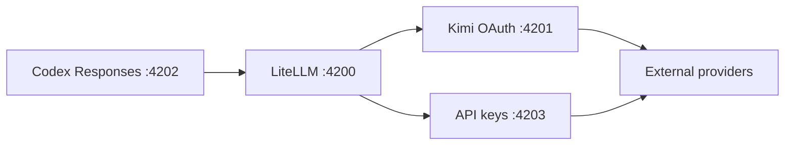

# Codex Router

## Install everything (recommended)

This is the default setup: **guided provider setup + Electron Control Center +
tray/menu-bar app + macOS desktop widget**.

### macOS or Linux

Copy and paste this into Terminal:

```sh
curl -fsSL https://raw.githubusercontent.com/duolahypercho/codex-router/main/install.sh \
  | sh -s -- --target codex --guided --with-tray
```

### Windows

Copy and paste this into PowerShell:

```powershell
$installer = Join-Path $env:TEMP "codex-router-install.ps1"
Invoke-WebRequest https://raw.githubusercontent.com/duolahypercho/codex-router/main/install.ps1 -OutFile $installer
powershell.exe -NoProfile -ExecutionPolicy Bypass -File $installer -Target codex -Guided -WithTray
```

That is the complete installation. It asks which providers you want and keeps
credential entry in private local prompts.

When it finishes:

1. Fully quit and reopen Codex.
2. Start a new task and choose a routed model.
3. Open **Codex Router** to use the Control Center.

On macOS, open **Codex Router** from Spotlight or `~/Applications`; its icon
stays in the menu bar when the Control Center is closed. The desktop widget is
already included: choose **Settings → Dynamic Island → Desktop** from the
menu-bar app to show it. It is a movable Codex Router panel rather than an item
in macOS's **Edit Widgets** gallery.

macOS does not have a public `.dmg` yet; the command above builds and installs
the app locally. That build requires the full Xcode app, not only the standalone
Command Line Tools, because it contains SwiftUI macro and WidgetKit targets. The
installer honors `DEVELOPER_DIR` or the Xcode selected under **Xcode → Settings
→ Locations → Command Line Tools**. If that selection still points at the
standalone tools, it uses `/Applications/Xcode.app` or
`/Applications/Xcode-beta.app` for this build only without changing the global
selection. For an Xcode app in another location, retry the companion with:

```sh
env DEVELOPER_DIR="/path/to/Xcode.app/Contents/Developer" \
  ~/.local/share/codex-router/bin/model-router-tray
```

## What Codex Router does

Use Anthropic, Kimi, DeepSeek, xAI, GitHub Copilot, and other external models
inside the Codex App and CLI. One local installation can also serve
[DeepSeek Harness](https://github.com/deepseek-ai/deepseek-harness) and
[Gemini CLI](https://github.com/google-gemini/gemini-cli), plus Cursor Agent
and Cursor App, Claude Code, and [OpenClaw](https://github.com/openclaw/openclaw).
Your provider
credentials stay on your computer.

### Subscription agent bridges (experimental)

The Harness page also detects three optional, client-owned agent sessions:
Claude Code, Cursor Agent, and Gemini CLI. These are deliberately separate from
the `codex_router/...` model catalog:

- Claude runs through the installed official `claude` process and its existing
  Claude.ai login. A successful `claude auth status` proves login only; the
  account must separately be entitled to use non-interactive/SDK turns. The
  bridge reports Anthropic's refusal verbatim when it is not.
- Cursor Agent runs through its official ACP stdio server (`agent acp`).
- Gemini CLI runs through its official ACP stdio server (`gemini --acp`).

The router never reads or copies those clients' OAuth tokens. It stores only
bounded metadata for sessions created through the bridge: client, session ID,
workspace path, and timestamps. Prompts and transcripts stay out of the bridge
index. File-system and terminal capabilities are not advertised yet, and
permission requests are rejected by default until the Control Center has a
foreground approval surface.

This is not an OpenAI-compatible subscription proxy. In particular, it does
not implement CLIProxyAPI's token-to-model-endpoint behavior and does not add
fake Claude, Cursor, or Gemini subscription models to another client's picker.

Inspect the optional bridges without spending a model request:

```sh
./bin/model-router codex agents status
./bin/model-router codex agents probe anthropic
./bin/model-router codex agents probe cursor
./bin/model-router codex agents probe gemini
```

Run a prompt only when you intend to spend the owning client's quota. Prompt
text is read from stdin so it is absent from the process list:

```sh
printf '%s' 'Explain this repository.' |
  ./bin/model-router codex agents prompt anthropic --cwd "$PWD"
```

The ACP integrations follow the official [Cursor ACP](https://prod.cursor.com/docs/cli/acp)
and [Gemini CLI ACP](https://github.com/google-gemini/gemini-cli/blob/main/docs/cli/acp-mode.md)
contracts. Direct reuse of Gemini CLI OAuth tokens in third-party software is
not implemented; Google's published [Gemini CLI terms](https://github.com/google-gemini/gemini-cli/blob/main/docs/resources/tos-privacy.md)
explicitly prohibit that access pattern.

Codex Router is an independent community project. It is not affiliated with or
endorsed by OpenAI, GitHub, Anthropic, Moonshot AI, DeepSeek, OpenRouter,
opencode, Google, or the referenced opencodex project.

## Give the link to your agent

Paste this into a Codex task:

```text
Install the router from this public repository:
https://github.com/duolahypercho/codex-router

Follow AGENTS.md. Preserve my existing Codex models, profiles, settings, and
ChatGPT login. Use only the provider authentication I choose, safely migrate
only recognized older versions, run the Codex doctor, and leave the final app
restart to me. Never ask me to paste a token or API key into chat.
```

If compatible authentication already exists, an agent can finish everything
except the final app restart. Provider credentials are entered only through a
hidden local terminal prompt.

## Other installation methods

### Homebrew (macOS or Linux)

Codex Router is not in `homebrew/core` yet, so `brew install codex-router` by
itself does not work. For now, add this repository as a tap once:

```sh
brew tap duolahypercho/codex-router https://github.com/duolahypercho/codex-router
brew install codex-router
codex-router setup --guided
```

The tap URL is needed only once. Homebrew installs the formula's Node.js,
Python, and build dependencies; `codex-router setup --guided` performs the
one-time provider selection, credential-safe authentication, background
service installation, and Codex integration. When setup finishes, fully quit
and reopen Codex, create a new task, and choose a routed model from the picker.

Homebrew is the **router/CLI-only** installation. It deliberately does not
build or download the Electron Control Center, tray/menu-bar app, or macOS
desktop widget during setup. If you want those, use the recommended installer
at the top of this README instead.

Upgrade an existing Homebrew installation with:

```sh
brew upgrade codex-router
```

#### Homebrew command equivalents

A Homebrew install puts a single `codex-router` command on your PATH instead
of this repository's `bin/` directory. Wherever the rest of this README shows
`./bin/model-router codex <command>` or `./bin/<command>`, run:

```sh
codex-router <command>
```

List everything the packaged build exposes with:

```sh
codex-router help
```

To add a custom provider's models — the packaged equivalent of
`./bin/curate-models <provider>` — run:

```sh
codex-router curate-models <provider>
```

`codex-router install` is deliberately unavailable: a Homebrew install has no
writable checkout to rewrite, and `brew upgrade codex-router` performs that
step itself.

Before removing the formula, remove the per-user service and managed Codex
configuration that Homebrew does not own:

```sh
codex-router uninstall
brew uninstall codex-router
```

The first Homebrew install can take considerably longer than the guided
installer below because the formula builds the locked Python dependencies from
source. The release workflow generates `Formula/codex-router.rb` from
`requirements/python.txt` and refreshes it for each release.

Maintainers preparing the eventual `homebrew/core` submission should follow
[`docs/HOMEBREW_CORE.md`](docs/HOMEBREW_CORE.md).

### npm

This project does not publish an npm-installable CLI yet. Do not use
`npm install codex-router` for this project. Use the recommended installer or
Homebrew above; a future npm package should use the scoped name
`@duolahypercho/codex-router` so it cannot be confused with existing packages.

### Guided installer

macOS or Linux:

```sh
curl -fsSL https://raw.githubusercontent.com/duolahypercho/codex-router/main/install.sh \
  | sh -s -- --target codex --guided
```

Windows PowerShell:

```powershell
$installer = Join-Path $env:TEMP "codex-router-install.ps1"
Invoke-WebRequest https://raw.githubusercontent.com/duolahypercho/codex-router/main/install.ps1 -OutFile $installer
powershell.exe -NoProfile -ExecutionPolicy Bypass -File $installer -Target codex -Guided
```

The setup selects providers, detects existing authentication, can run the
official `kimi login`, prompts invisibly for provider credentials, installs a per-user
background service, and verifies every local layer. It never makes a paid test
request unless `--smoke-test` is explicitly selected.

To validate the install and uninstall lifecycle before trusting the router
with any credential, pass `--no-provider --no-discovery`: the router installs
idle, reads no credential from anywhere, and answers Codex traffic with a
local error. See [docs/INSTALL.md](docs/INSTALL.md#credential-free-idle-install).

Requirements:

- The Codex App or CLI.
- Node.js 22.19 or newer; Node.js 24 LTS is recommended.
- `uv`, or Python 3.10+ with `venv`.
- Git for the managed one-command checkout and rollback.
- On Windows, Windows PowerShell must run in `FullLanguage` mode and local
  application-control policy must permit `Add-Type`. The router checks this
  before starting a mutation child; it does not weaken or bypass that policy.

Linux installations support the Codex CLI.

## Models and authentication

| Picker label | Model ID | Authentication |
| --- | --- | --- |
| K2.7 Coding Highspeed (OAuth) | `kimi-oauth/kimi-for-coding-highspeed` | Existing Kimi Code CLI OAuth session |
| K2.7 Coding (OAuth) | `kimi-oauth/kimi-for-coding` | Existing Kimi Code CLI OAuth session |
| Kimi K3 (OAuth) | `kimi-oauth/k3` | Existing Kimi Code CLI OAuth session |
| Kimi K3 (API) | `kimi-api/kimi-k3` | Separately billed Kimi Platform API key |
| Kimi K3 (China API) | `kimi-api-cn/kimi-k3` | Separately billed Moonshot **China** platform key |
| DeepSeek V4 Flash (API) | `deepseek/deepseek-v4-flash` | DeepSeek API key |
| DeepSeek V4 Pro (API) | `deepseek/deepseek-v4-pro` | DeepSeek API key |
| Grok 4.5 (OAuth) | `grok-oauth/grok-4.5` | Official Grok CLI OAuth session |
| Grok 4.5 (API) | `grok-api/grok-4.5` | Separately billed xAI API key |
| Claude Opus 4.8 (API) | `anthropic-api/claude-opus-4.8` | Separately billed Anthropic API key |
| GLM-5.2 (Ollama Cloud) | `ollama-cloud/glm-5.2` | Ollama Cloud API key |
| GLM-5.3 (Ollama Cloud) | `ollama-cloud/glm-5.3` | Ollama Cloud API key |
| GLM-5.3-Flash (Ollama Cloud) | `ollama-cloud/glm-5.3-flash` | Ollama Cloud API key |
| Kimi K2.7 Code (Ollama Cloud) | `ollama-cloud/kimi-k2.7-code` | Ollama Cloud API key |
| Kimi K3 (Ollama Cloud) | `ollama-cloud/kimi-k3` | Ollama Cloud API key |
| MiniMax M3 (Ollama Cloud) | `ollama-cloud/minimax-m3` | Ollama Cloud API key |
| DeepSeek V4 Pro (Ollama Cloud) | `ollama-cloud/deepseek-v4-pro` | Ollama Cloud API key |
| DeepSeek V4 Flash (Ollama Cloud) | `ollama-cloud/deepseek-v4-flash` | Ollama Cloud API key |
| MiniMax M3 | `minimax-token-plan/minimax-m3` | MiniMax Token Plan API key |
| MiMo-V2.5 (Xiaomi API) | `xiaomi-mimo/mimo-v2.5` | Xiaomi MiMo API key |
| MiMo-V2.5-Pro (Xiaomi API) | `xiaomi-mimo/mimo-v2.5-pro` | Xiaomi MiMo API key |
| Qwen3.8 Max (Plan) | `qwen-plan/qwen3.8-max` | Alibaba Model Studio plan API key |
| Qwen3.8 Max Preview (Plan) | `qwen-plan/qwen3.8-max-preview` | Alibaba Model Studio plan API key |
| Qwen3.7 Max (Plan) | `qwen-plan/qwen3.7-max` | Alibaba Model Studio plan API key |
| Qwen3.7 Plus (Plan) | `qwen-plan/qwen3.7-plus` | Alibaba Model Studio plan API key |
| Qwen3.6 Flash (Plan) | `qwen-plan/qwen3.6-flash` | Alibaba Model Studio plan API key |
| DeepSeek V4 Pro (Qwen Plan) | `qwen-plan/deepseek-v4-pro` | Alibaba Model Studio plan API key |
| DeepSeek V4 Flash (Qwen Plan) | `qwen-plan/deepseek-v4-flash-0731` | Alibaba Model Studio plan API key |
| GLM-5.2 (Qwen Plan) | `qwen-plan/glm-5.2` | Alibaba Model Studio plan API key |
| GLM-5.3 (Coding Plan) | `zai-coding/glm-5.3` | Z.ai GLM Coding Plan API key |
| GLM-5.2 (Coding Plan) | `zai-coding/glm-5.2` | Z.ai GLM Coding Plan API key |
| GLM-5-Turbo (Coding Plan) | `zai-coding/glm-5-turbo` | Z.ai GLM Coding Plan API key |
| GLM-5.3-Flash (Z.ai API) | `zai-api/glm-5.3-flash` | Separately billed Z.ai platform API key |
| GLM-5.3 (Z.ai API) | `zai-api/glm-5.3` | Separately billed Z.ai platform API key |
| GLM-5.2 (Z.ai API) | `zai-api/glm-5.2` | Separately billed Z.ai platform API key |
| GLM-4.7 (Z.ai API) | `zai-api/glm-4.7` | Separately billed Z.ai platform API key |
| Muse Spark 1.2 (Meta) | `meta/muse-spark-1.2` | Meta Model API key |
| Muse Spark 1.2 Contributor (Meta) | `meta/muse-spark-1.2-contributor` | Meta Model API key |
| Muse Spark 1.1 (Meta) | `meta/muse-spark-1.1` | Meta Model API key |
| Hy4 Preview (ClinePass) | `clinepass/tencent/hy4-preview` | ClinePass API key |
| Hy4 Preview (Command Code) | `commandcode/hy4-preview` | Command Code API key |
| Hy4 Preview (NanoGPT) | `nano-gpt/tencent/hy4-preview` | NanoGPT API key |
| Hy4 Preview (Nous Research) | `nousresearch/tencent/hy4-preview` | Nous Portal API key |
| Hy4 Preview (opencode Go) | `opencode-go/hy4-preview` | opencode Go/Zen API key |
| Hy4 Preview (OpenRouter) | `openrouter/tencent/hy4-preview` | OpenRouter API key |
| GLM-5.2 (ClinePass) | `clinepass/glm-5.2` | ClinePass API key |
| Kimi K3 (ClinePass) | `clinepass/kimi-k3` | ClinePass API key |
| Kimi K2.7 Code (ClinePass) | `clinepass/kimi-k2.7-code` | ClinePass API key |
| Kimi K2.6 (ClinePass) | `clinepass/kimi-k2.6` | ClinePass API key |
| DeepSeek V4 Pro (ClinePass) | `clinepass/deepseek-v4-pro` | ClinePass API key |
| DeepSeek V4 Flash (ClinePass) | `clinepass/deepseek-v4-flash` | ClinePass API key |
| MiMo-V2.5 (ClinePass) | `clinepass/mimo-v2.5` | ClinePass API key |
| MiMo-V2.5-Pro (ClinePass) | `clinepass/mimo-v2.5-pro` | ClinePass API key |
| MiniMax M3 (ClinePass) | `clinepass/minimax-m3` | ClinePass API key |
| Qwen3.7 Max (ClinePass) | `clinepass/qwen3.7-max` | ClinePass API key |
| Qwen3.7 Plus (ClinePass) | `clinepass/qwen3.7-plus` | ClinePass API key |
| Qwen3.8 Max (ClinePass) | `clinepass/qwen3.8-max` | ClinePass API key |

Kimi has two API platforms and they are not interchangeable. `kimi-api` is the
global console at platform.moonshot.ai; `kimi-api-cn` is the mainland console at
platform.moonshot.cn. Accounts, billing, and keys are separate — a key minted on
one platform is rejected by the other — so each is enabled and credentialed on
its own, and both can be active at once. Pick the one matching where your key
was created. (`kimi-oauth` is a third, distinct thing: the Kimi Code
subscription reused through the official CLI's session.)

The Codex catalog is credential-aware. It includes models only from enabled
external providers with a stored credential or valid OAuth session. Native GPT
models are included only when `codex login status` confirms an OpenAI login.

Qwen is key-only. Alibaba discontinued the Qwen Code OAuth free tier on
2026-04-15, so the Model Studio plan key is the sole Qwen surface; `qwen-plan`
points at the token-plan endpoint. Set `QWEN_PLAN_BASE_URL` to
`https://dashscope-intl.aliyuncs.com/compatible-mode/v1` to bill a
pay-as-you-go DashScope key through the same provider. Alibaba publishes no
quota or balance API on either endpoint, so the tray shows router-observed
traffic and links to the console for actual spend.

ClinePass uses Cline's OpenAI-compatible API at
`https://api.cline.bot/api/v1`. An API key alone does not grant access to the
`cline-pass/*` models: the account also needs an active ClinePass subscription.
Create the key under Cline Settings > API Keys, then store it with
`./bin/model-router codex provider-key clinepass set`.

Grok OAuth reuses the official CLI credential at `~/.grok/auth.json` and sends
it only to xAI's documented Grok CLI inference proxy. On that path the router
also attaches bare hosted `web_search` and `x_search` tools, the same agentic
surface Grok Build uses. xAI's backend chooses when to search and how to filter
results; the router does not take search env knobs or request-side filter
config. Install the official CLI and authenticate before enabling the route:

Other routed providers can use Codex's client-side (standalone) web search when
the selected model has been verified for it. DeepSeek V4 Flash is enabled on
its direct API and opencode Go routes. A compatible model declares
`"searchTool": { "mode": "standalone" }` in its registry or user-model
metadata. This capability is resolved from the selected model/provider pair;
the managed Codex provider block enables the provider half of standalone
search so verified models can use it, while the merged catalog remains the
per-model gate. The router never infers compatibility from an
OpenAI-compatible endpoint. A model is advertised only after its exact
provider path has been verified to preserve Codex search-result items and
tool-call history. If Codex attaches hosted-search fields to an unsupported
runtime-generic route anyway, the managed Responses boundary removes only
those search extensions before the strict upstream sees them.

For a routed model that has no verified standalone or provider-hosted search,
Codex can instead use an explicit Perplexity Search sidecar. This is not a
global fallback: the binding names one exact routed model, uses a separately
stored Perplexity API key, and is refused for a model that already owns a
search capability. The adapter implements Perplexity's raw
[`POST /search`](https://docs.perplexity.ai/api-reference/search-post) API and
accepts only Codex `search_query` commands; unsupported filters or other web
commands fail by name.

Create the trusted provider descriptor, enter the key at the hidden terminal
prompt, and bind the model:

```sh
./bin/model-router codex providers generic add perplexity-search \
  --name "Perplexity Search" \
  --base-url https://api.perplexity.ai \
  --adapter openai-chat
./bin/model-router codex providers generic credential perplexity-search set
./bin/model-router codex search-sidecar set PROVIDER/MODEL perplexity-search
./bin/model-router codex search-sidecar status PROVIDER/MODEL
```

The credential command never accepts the key as an argument. The descriptor,
credential reference, and per-model binding are private, atomic state; the key
remains in the generic-provider protected credential file. Search requests use
the generic-provider DNS-pinned, redirect-refusing transport. Result URLs must
resolve publicly, credential-bearing citations are rejected, the whole
operation shares one timeout across retry and backoff, and cache entries are
scoped by caller account, model, provider, and credential reference. Removing
the generic provider also removes its credential and every dependent sidecar
binding. Fully quit and reopen Codex after changing a binding so its model
catalog refreshes.

On Windows, the same commands are available through `codex-router.ps1`:

```powershell
.\codex-router.ps1 providers generic add perplexity-search --name "Perplexity Search" --base-url https://api.perplexity.ai --adapter openai-chat
.\codex-router.ps1 providers generic credential perplexity-search set
.\codex-router.ps1 search-sidecar set PROVIDER/MODEL perplexity-search
```

```sh
npm install -g @xai-official/grok
grok login --oauth
```

> [!WARNING]
> **Antigravity OAuth has no bundled or shared OAuth client.** Create and use a
> Google OAuth Desktop-app client pair that you own, as described below. A
> Google AI Pro/Ultra subscription, Gemini API key, Google account, or existing
> `agy` CLI login does not supply that pair, and the router never copies the
> official `agy` identity or credential store. Do not use the old
> `your-integration-client-secret` placeholder: it cannot work.

> [!IMPORTANT]
> **The Cloud project behind your OAuth client must be allowlisted for
> `cloudcode-pa.googleapis.com`, and most projects are not.** The bootstrap call
> is billed to the project that owns the calling OAuth client, so an
> operator-owned client bills your project rather than Google's. That service is
> a private API: binding it needs the producer-side
> `servicemanagement.services.bind` permission, so `gcloud services enable`
> fails even for the project owner, and it has no API Library entry to enable
> through the console.
>
> Sign-in still succeeds; the live probe is what fails, with
> `PERMISSION_DENIED` / `SERVICE_DISABLED`. If your project is not allowlisted,
> **this provider cannot currently be used** — there is no operator-side
> workaround, and no configuration in this repository changes it. See
> [#566](https://github.com/duolahypercho/codex-router/issues/566).

Create a Google OAuth **Desktop app** client in a Google Cloud project you own:

1. In Google Cloud Console, open **APIs & Services > OAuth consent screen** and
   configure the app for your account with a truthful name such as **Codex
   Router**—not Antigravity (add the account as a test user when the consent
   screen is in testing mode).
2. Open **APIs & Services > Credentials**, choose **Create credentials > OAuth
   client ID**, and select **Desktop app**. Keep the resulting client ID and
   matching secret in that private browser tab.
3. Run the login command below and enter that one pair only in the local setup
   page it opens.

Do not copy the official Antigravity/`agy` client or credential store. The
login command binds `127.0.0.1` on an OS-assigned ephemeral port before it
constructs the redirect. It opens only a loopback URL through the operating
system; the local listener redirects the browser to Google, so neither client
value is put in process arguments or terminal output. The pair and tokens are
persisted together in the router's owner-only state and are never copied to a
background-service environment.

If an older incompatible router credential is already present, the new flow
preserves it and asks you to run `providers disconnect antigravity-oauth`
before sign-in; it never silently upgrades, reuses, or overwrites that record.

```sh
./bin/model-router codex providers login antigravity-oauth
./bin/model-router codex providers probe antigravity-oauth --live --yes
./bin/model-router codex providers enable antigravity-oauth
```

On Windows PowerShell, use the matching wrapper:

```powershell
.\model-router.ps1 codex providers login antigravity-oauth
.\model-router.ps1 codex providers probe antigravity-oauth --live --yes
.\model-router.ps1 codex providers enable antigravity-oauth
```

The probe sends a small real prompt and consumes provider quota. It uses the
truthful `codex-router` identity and must succeed before the route can be
enabled. If the account has no companion project, rerun the probe with
`--provision-project` only after authorizing that side effect. Provisioning still
requires a successful, schema-valid bootstrap response that explicitly
advertises the tier it will use; auth errors, server errors, malformed
responses, and missing tiers all fail closed. This remains an unofficial
compatibility route over Google's internal Antigravity service,
not a public Gemini API contract; if Google serves only the impersonated vendor
client, the router deliberately leaves this provider disabled.

After proof, the command records a nonpublishable pending generation and
restarts an installed router service. Startup health-checks that exact proof
and promotes it only after the complete local stack is ready; restart failure
or process death leaves it disabled. Proof records from the earlier v2 writer
that have no activation metadata are unverified and require the explicit live
probe again. Before proof the Antigravity forwarder
does not bind a port, so an unused provider cannot make the rest of the router
fail to start. If you run the router in the foreground for development,
restart that foreground process before enabling the provider.

MiMo (Xiaomi API) uses Xiaomi's official OpenAI-compatible endpoint at
`https://api.xiaomimimo.com/v1`. Unlike MiMo reseller routes, the direct API
serves `mimo-v2.5` and `mimo-v2.5-pro` through the standard
`/chat/completions` surface, so requests never touch the Responses gateway.
`mimo-v2.5` is verified for text/image input and Codex standalone web search;
`mimo-v2.5-pro` is text-only. Store the key with
`./bin/model-router codex provider-key xiaomi-mimo set`.

Native GPT models continue to use Codex directly. There is no separate GPT or
ChatGPT OAuth provider in the router.

### GitHub Copilot

`github-copilot` routes account-visible models that explicitly advertise the
Responses API, streaming, and tool calls. The catalog is plan- and
policy-specific, so this provider ships no hard-coded models: store a
fine-grained GitHub PAT with the **Copilot Requests** permission, then curate
from the live catalog. This initial integration targets GitHub.com; GitHub
Enterprise Cloud data-residency hosts are not yet configured by the router.

```sh
./bin/model-router codex provider-key github-copilot set
./bin/curate-models github-copilot
```

The hidden prompt stores the GitHub token in protected router state. For a
foreground process, `COPILOT_GITHUB_TOKEN`, `GH_TOKEN`, and `GITHUB_TOKEN` are
checked in that order. Classic `ghp_` tokens are not supported by Copilot;
create a fine-grained `github_pat_` token
at [GitHub personal access tokens](https://github.com/settings/personal-access-tokens/new).
The router deliberately does not read or copy the official Copilot CLI's
credential store.

At request time the GitHub credential is validated through the Copilot account
endpoint, which also selects the account's inference host. That host is accepted
only when it is GitHub-owned. The tray reads the account's AI-credit or legacy
request quota when GitHub exposes a per-user meter; organization-managed plans
that expose no per-seat quota fall back to router-observed traffic.

GitHub documents the PAT permission and Copilot clients, while the inference
interface may continue to evolve. Requests consume the user's Copilot
allowance; use it
within the [GitHub Copilot terms](https://docs.github.com/site-policy/github-terms/github-terms-for-additional-products-and-features#github-copilot)
and [acceptable use policies](https://docs.github.com/site-policy/acceptable-use-policies/github-acceptable-use-policies).

Kimi Code OAuth and Kimi Platform API access are separate authentication and
billing systems. The two Kimi entries intentionally coexist. Older DeepSeek
aliases remain hidden compatibility routes and are not advertised to new users.


The Ollama Cloud entries bill through an ollama.com account and can host the
same model families as other providers under a separate quota. Matching entries
(for example DeepSeek V4 Pro) intentionally coexist with the vendor-direct
providers because credentials and billing differ.
The Qwen plan entries cover every chat model the Individual Plan serves,
including the cross-vendor models it resells (DeepSeek V4 and GLM-5.2) under
the same plan key and quota. The cross-vendor entries use DashScope's
compatible-mode request profile because DashScope rejects each vendor's native
thinking parameters.
The Qwen entries default to the Alibaba Model Studio Token Plan endpoint in
the Singapore region. Coding Plan subscribers or other regions can point
`QWEN_PLAN_BASE_URL` at their dashboard-issued base URL. Plan keys use the
`sk-sp-` prefix and are separate from pay-as-you-go Model Studio keys; Alibaba
reserves plan endpoints for interactive coding tools.
The `zai-coding` entries use the GLM Coding Plan's dedicated endpoint and its
subscription API key. That key is not interchangeable with general Z.ai
platform keys, and Z.ai reserves the coding endpoint for interactive coding
tools. The metered platform is therefore a separate provider, `zai-api`, on
`https://api.z.ai/api/paas/v4` with its own key file and its own environment
variable (`ZAI_PLATFORM_API_KEY`, never the plan's `ZAI_API_KEY`) — connecting
one does not connect the other. GLM-5.3 ships on both routes with Z.ai's
documented low/high/max reasoning tiers and a one-million-token context
window. The `[1m]` model suffix that circulated for GLM-5.3 does not exist on
either Z.ai endpoint -- both the OpenAI-compatible coding route and the
Anthropic route reject `glm-5.3[1m]` with error 1214 -- and it was never
needed: a live run accepted 990,020 prompt tokens on the plain `glm-5.3`
code.
Beyond the built-in models, each API-key provider's live catalog can be
curated interactively: `./bin/curate-models PROVIDER` lists the models the
provider currently advertises that are not in the registry, lets you toggle
the ones you want, and stores them as user models in protected state
(surviving updates, editable in place, and removable by re-running the
command and deselecting). Curation asks for each new model's context window,
image support, and reasoning efforts — so curated models get the effort
switcher in the picker — and everything defaults conservatively when
unanswered. The context window is not guessed when the provider publishes one:
the `context_length` its catalog advertises for the model is offered as the
default and stored by both curation forms, so a million-token model is not
filed as a 131K one and told to compact at 110K. The non-interactive
`--models id1,id2` form is additive: it keeps
existing curated entries and their metadata while adding the named models;
`--efforts minimal,low,medium,high,xhigh` sets the new entries' ladder. Remove
entries explicitly with `--remove id1,id2`. Every value stays editable in
`user-models.json`. Curation also asks whether the model rejects a forced
`tool_choice`: a few upstreams call tools happily when the choice is `auto`
but answer HTTP 400 when one is required, which fails the compatibility check
and the routed-subagent handoff even though tool calling works. Answering yes
stores `"requestProfile": "auto-tool-choice"`, and the router downgrades the
forced choice for that model only (`--request-profile auto-tool-choice` in the
`--models` form), for example:

```sh
./bin/curate-models PROVIDER --models MODEL_ID --request-profile auto-tool-choice
```

For an already-curated model, edit only that entry's `requestProfile` in the
protected `user-models.json`, preserving its existing context, modalities,
efforts, and other hand-tuned metadata; do not remove and re-add it or apply a
broader vendor profile just to repair `tool_choice`. The provider's own
`/v1/models` endpoint always decides which models exist. Curated models are
local to your machine and are not vetted by the repository's compatibility
tests.

The same managed OpenAI base URL also serves `/v1/embeddings`, but only for a
model whose local or checked-in metadata explicitly names the capability. A
model that is both conversational and embedding-capable declares its normal
provider route plus `"/embeddings"`, for example:

```json
"supportedEndpoints": ["/chat/completions", "/embeddings"]
```

A dedicated embedding model uses only `"/embeddings"` and must set
`"listed": false` so it never appears as a conversational Codex model. Live
catalog discovery does not infer this capability. Requests and responses are
bounded to 8 MiB by default, caller cancellation reaches the provider, query
parameters on the secret-bearing capability URL are dropped, and embedding
requests are never retried or passed through a chat adapter. Redirects are
refused on both internal and provider hops so 307/308 cannot replay the POST.
The provider's normal credential isolation and generic-provider DNS checks
still apply. Messages-native provider protocols cannot opt into this OpenAI
endpoint.

### opencode (Go subscription and Zen)

The opencode provider family covers both of opencode's endpoints with one
stored API key (`OPENCODE_API_KEY` or `OPENCODE_GO_API_KEY` in the
environment): the flat-rate **Go** subscription at
`https://opencode.ai/zen/go/v1`, whose tested models ship in the registry
below, and the pay-per-use **Zen** endpoint at `https://opencode.ai/zen/v1`,
whose larger catalog is available through local curation
(`./bin/curate-models opencode-zen`). Everything appears as a single
"opencode Go/Zen" provider; internally the catalog is split across provider
IDs by
endpoint and by the protocol each model speaks upstream. Set the key once and
enable the family:

```sh
./bin/model-router codex provider-key opencode-go set
./bin/model-router codex providers enable opencode-go
```

An optional API-key pool can rotate between the two registry-declared
OpenCode environment sources without copying either secret into pool or
credential metadata. Export the values in an interactive shell (never put a
key in a command argument or chat). If the managed router is already running,
stop it before adding a new environment-backed entry: a running service cannot
inherit a newly named shell variable, and the command refuses to publish a
route the service could not authenticate.

```sh
codex-router key-pool opencode-go add-env OPENCODE_API_KEY
codex-router key-pool opencode-go add-env OPENCODE_GO_API_KEY
codex-router key-pool opencode-go policy round-robin
codex-router key-pool opencode-go status
```

Then rerun the installer from that same shell with `--providers configured`
(and the same target you installed originally). The installer copies only the
allowlisted variables referenced by the pool into the owner-only service
definition and starts it. A plain service restart is not enough because it
replays the old definition. Rerun the installer after removing or deleting an
environment-backed entry as well, so its old value is removed from the service
definition.

`pause <credential-id>` and `resume <credential-id>` change one entry without
deleting its credential metadata. Once a pool exists it is authoritative: an
empty, invalid, or unresolvable pool fails closed instead of silently spending
the legacy single key. A pre-response `429` can rebind the request to another
healthy entry; failover stops once response headers or body bytes have been
committed.

The desktop panel and macOS tray Settings tab provide both per-model controls
and provider-level Select all / Unselect all actions for which registry-proven
v2 models can run as subagents and which models appear in installed client
pickers. Local settings cannot promote an unverified model. Fully quit and
reopen Codex after changing either list; DeepSeek Harness hot-reloads its route,
and the next Gemini CLI invocation reads the new environment.
The Control Center keeps Go and pay-per-use Zen under this one credential card,
but exposes each live catalog as a separate source. Loading a catalog only
caches and previews its candidates; models are added to the picker only after
the operator explicitly selects them.

| Picker label | Model ID |
| --- | --- |
| Grok 4.6 (opencode Go) | `opencode-go-responses/grok-4.6` |
| Grok 4.5 (opencode Go) | `opencode-go-responses/grok-4.5` |
| GLM-5.3-Flash (opencode Go) | `opencode-go/glm-5.3-flash` |
| GLM-5.3 (opencode Go) | `opencode-go/glm-5.3` |
| GLM-5.2 (opencode Go) | `opencode-go/glm-5.2` |
| GLM-5.1 (opencode Go) | `opencode-go/glm-5.1` |
| GLM-5 (opencode Go, legacy) | `opencode-go/glm-5` |
| Kimi K3 (opencode Go) | `opencode-go/kimi-k3` |
| Kimi K2.7 Code (opencode Go) | `opencode-go/kimi-k2.7-code` |
| Kimi K2.6 (opencode Go) | `opencode-go/kimi-k2.6` |
| Kimi K2.5 (opencode Go, legacy) | `opencode-go/kimi-k2.5` |
| LongCat-2.0 (opencode Go) | `opencode-go/longcat-2.0` |
| DeepSeek V4 Pro (opencode Go) | `opencode-go/deepseek-v4-pro` |
| DeepSeek V4 Flash (opencode Go) | `opencode-go/deepseek-v4-flash` |
| DeepSeek V4 Flash Vision Exp (opencode Go) | `opencode-go/deepseek-v4-flash-vision-exp` |
| MiMo-V2.5 (opencode Go) | `opencode-go/mimo-v2.5` |
| MiMo-V2.5-Pro (opencode Go) | `opencode-go/mimo-v2.5-pro` |
| Hy3 (opencode Go) | `opencode-go/hy3` |
| Hy4 Preview (opencode Go) | `opencode-go/hy4-preview` |
| MiniMax M3 (opencode Go) | `opencode-go-messages/minimax-m3` |
| MiniMax M2.7 (opencode Go) | `opencode-go-messages/minimax-m2.7` |
| MiniMax M2.5 (opencode Go) | `opencode-go-messages/minimax-m2.5` |
| Qwen3.8 Max (opencode Go) | `opencode-go-messages/qwen3.8-max` |
| Qwen3.7 Max (opencode Go) | `opencode-go-messages/qwen3.7-max` |
| Qwen3.7 Plus (opencode Go) | `opencode-go-messages/qwen3.7-plus` |
| Qwen3.6 Plus (opencode Go) | `opencode-go-messages/qwen3.6-plus` |
| Qwen3.5 Plus (opencode Go, legacy) | `opencode-go/qwen3.5-plus` |
| GPT 5.6 Luna (opencode Go) | `opencode-go-responses/gpt-5.6-luna` |

`opencode-go` carries the Chat Completions models, `opencode-go-messages` the
Anthropic Messages models, `opencode-go-responses` the Responses models
(including Grok 4.5 and Grok 4.6), and
`opencode-zen` the pay-per-use Zen endpoint (no preselected models — curate
the ones you want). All four are one selectable family: they share a single
stored key, and enabling or disabling any of them toggles all of them
together.
Entries that duplicate a vendor-direct provider (for example DeepSeek V4 Pro)
intentionally coexist because the subscription bills separately. Point
`OPENCODE_GO_BASE_URL` (or `OPENCODE_ZEN_BASE_URL`) elsewhere to override the
endpoints.

### Anonymous free model gateways

Two additional entries use providers' documented free-model exceptions. Neither
asks for an API key, neither is ever selected on your behalf, and each is pinned
in code to its official endpoint.

| Picker label | Provider ID | Endpoint | Free-model rule |
| --- | --- | --- | --- |
| OpenCode Free | `opencode-free` | `https://opencode.ai/zen/v1` | `big-pickle` and IDs ending in `-free` |
| Kilo Free | `kilo-free` | `https://api.kilo.ai/api/gateway` | IDs ending in `:free` |

Neither ships its free subset as checked-in metadata: everything comes from the
provider's live `/models` response, filtered to the free subset and then added
locally with `./bin/curate-models`. OpenCode Free curation routes
`muse-spark-1.2-contributor-free` through its internal Responses sibling while
keeping the other free IDs on Chat Completions; the provider remains one
selection in setup and the picker. An existing Chat-routed copy of that one Muse
model is migrated only when the operator explicitly runs `curate-models`;
install, update, and catalog reads do not rewrite the user model or picker
state. Zen's `/models` response publishes no context limits, so free IDs that
OpenCode documents are sized from its published metadata instead of the
conservative 131K fallback, and each stored entry's `description` records where
its window came from. Every other free ID keeps the conservative default, and
any window is editable in `user-models.json`.

```sh
./bin/model-router codex providers enable opencode-free
./bin/curate-models opencode-free

./bin/model-router codex providers enable kilo-free
./bin/curate-models kilo-free
```

OpenCode Console documents that free chat models can omit the bearer header;
the paid Console models still require a key. Kilo documents anonymous access
only for `:free` models and limits anonymous traffic to 200 requests per hour
per IP. Both catalogs and limits are provider-controlled and can change, so
the router refuses paid IDs and shows traffic-only usage when no quota header
has been observed. Kilo's general SDK setup guide still asks external SDK
users for an API key; this entry intentionally covers only the gateway's
documented anonymous `:free` path.

Kilo's catalog also advertises `tencent/hy4-preview`, but that ID is paid: it
does not end in `:free`. The Kilo Free route deliberately filters it out rather
than presenting HY4 as an anonymous model.

### Custom: one provider, many endpoints

Every other provider owns one address. `custom` owns none — each of its models
names its own endpoint, its own auth, and its own metadata, so a single picker
entry can hold a free community endpoint, a friend's self-hosted server, and a
paid API you have a key for, all at once.

```sh
./bin/model-router codex providers enable custom
```

Enabling it costs nothing and asks for nothing: a model that needs a key says so
on its own row. It is never selected for you and never part of the default set,
because what it holds is whatever somebody put in it.

| Model | Endpoint | Auth |
| --- | --- | --- |
| Qwen3.8-27-free-victor | `https://g9hnto0u7lvbu837.us-east-2.aws.endpoints.huggingface.cloud/v1` | none |

That first model is a free community [Hugging Face Inference
Endpoint](https://huggingface.co/spaces/victor/Qwen3.8-27B-free-endpoint) for
`Qwen/Qwen3.8-27B`, published by an individual rather than by Qwen or Hugging
Face: BF16 on one H200 behind vLLM, 262,144-token context, image input, tool
calling, and a thinking budget you dial with the normal effort picker. It is
shared and rate limited to roughly 30 requests per minute per IP, and its owner
says it will be retired once launch interest fades — so treat it as a model to
try, not one to depend on.

An endpoint reached with **no credential** is the one thing a registry fragment
cannot introduce on its own. Its address has to be allowlisted in
`src/model-registry.mjs`, exactly as an anonymous provider's is, because
otherwise adding a JSON file under `config/custom/` would be enough to send your
prompts to any host on the internet with nothing to authenticate them. An
endpoint that carries a key, or one that stays on loopback, needs no allowlist
entry — the key or the address is already the boundary.

> **Use these at your own risk.** The two gateways above, and any `custom` model
> whose endpoint carries no credential, are the only routes here that reach an
> upstream with no account behind them, and that changes what "supported" can
> mean. Nobody has agreed to serve you: access is a published exception, not an
> entitlement, and it can be narrowed, rate-limited, or withdrawn without
> notice. On the two reseller gateways the naming rule is a heuristic rather
> than a promise — their catalogs
> carry no pricing field to check, so a model whose ID says `free` can still
> answer `401 Paid inference requests require an Authorization bearer token`,
> and the router cannot tell in advance. Anonymous traffic is identified by IP,
> so a router fanning out parallel subagents spends a budget shared with
> everyone behind that address. Treat these as a way to try a model, not as
> something to depend on: nothing in this repository can keep them working, and
> a failure here is not a bug the project can fix.

### Command Code

Command Code's official Provider API is an OpenAI-compatible chat completions
surface plus an Anthropic Messages surface at `https://api.commandcode.ai/provider/v1`
(`COMMAND_CODE_API_KEY` or `COMMANDCODE_API_KEY` in the environment, or store
the key once). Every plan except Go has API access; GOAT, Pro, Max, Team, and
Provider accounts use the API. Everything appears as one
"Command Code" provider; internally the catalog is split between
`commandcode` for Chat Completions models and `commandcode-messages` for
models that require the Messages protocol (Claude).

**The Go plan uses the coding-plan route.** A Go-plan account is refused by
`/provider/v1` with `403 upgrade_required` even though its key is valid. When
that exact entitlement response arrives before any response byte has been
relayed, the router retries the turn through Command Code's `/alpha/generate`
transport and remembers the result for that credential. Other 403s, timeouts,
rate limits, and server failures do not trigger the fallback. The route is
rechecked periodically so an upgraded account returns to the documented
Provider API. Both paths use the same stored key and provider family.

**Store an API key.** Create one in Command Code Studio and save it here:

```sh
./bin/model-router codex provider-key commandcode set
./bin/model-router codex providers enable commandcode
```

When multiple API-key sources exist, the exported environment variable wins,
then the key stored here, then the macOS Keychain. `doctor` names whichever
source is live. The router does not install, launch, or read a Command Code CLI
session; `/alpha/generate` is called directly as an inference transport.

Command Code's [headless CLI](https://commandcode.ai/docs/headless) is a
complete autonomous coding agent with its own workspace, tools, permission
decisions, sessions, and compaction. Launching it behind one Codex Responses
request would create a second, hidden tool loop and would bypass Codex's tool
events and approvals. It therefore cannot transparently replace the Codex
harness or transfer CLI-only AST/context/taste optimizations into the Codex
app. Codex remains the harness; this router only adapts the model transport and
preserves Command Code's reported cached-token usage.

| Picker label | Model ID |
| --- | --- |
| DeepSeek V4 Flash (Command Code) | `commandcode/deepseek-v4-flash` |
| DeepSeek V4 Pro (Command Code) | `commandcode/deepseek-v4-pro` |
| GLM-5.2 (Command Code) | `commandcode/glm-5.2` |
| Kimi K3 (Command Code) | `commandcode/kimi-k3` |
| Kimi K2.7 Code (Command Code) | `commandcode/kimi-k2.7-code` |
| Qwen3.8 Max (Command Code) | `commandcode/qwen3.8-max` |
| Qwen3.7 Max (Command Code) | `commandcode/qwen3.7-max` |
| Qwen3.7 Plus (Command Code) | `commandcode/qwen3.7-plus` |
| MiniMax M3 (Command Code) | `commandcode/minimax-m3` |
| MiniMax M2.7 (Command Code) | `commandcode/minimax-m2.7` |
| MiMo-V2.5-Pro (Command Code) | `commandcode/mimo-v2.5-pro` |
| Grok 4.5 (Command Code) | `commandcode/grok-4.5` |
| GPT 5.6 Luna (Command Code) | `commandcode/gpt-5.6-luna` |
| GPT 5.5 (Command Code) | `commandcode/gpt-5.5` |
| Gemini 3.5 Flash (Command Code) | `commandcode/gemini-3.5-flash` |
| Hy3 (Command Code) | `commandcode/hy3-paid` |
| Hy4 Preview (Command Code) | `commandcode/hy4-preview` |
| Step 3.7 Flash (Command Code) | `commandcode/step-3.7-flash` |
| Claude Sonnet 5 (Command Code) | `commandcode-messages/claude-sonnet-5` |
| Claude Opus 4.8 (Command Code) | `commandcode-messages/claude-opus-4.8` |
| Claude Fable 5 (Command Code) | `commandcode-messages/claude-fable-5` |
| Claude Haiku 4.5 (Command Code) | `commandcode-messages/claude-haiku-4.5` |

Both entries are one selectable family that shares a single stored key;
enabling or disabling either toggles the whole family together. The live
catalog is available without authentication from
`https://api.commandcode.ai/provider/v1/models`, and additional models can be
added per machine with `./bin/curate-models commandcode`. Point
`COMMANDCODE_BASE_URL` elsewhere to override the endpoint — both routes follow
it, so a redirected provider stays coherent. The tray reports the plan's
remaining credits and its 5-hour and weekly windows from the same undocumented
billing route the official CLI polls, and links to Command Code Studio when
that route is unavailable.

### Ox Alpha

Ox Alpha is a stealth reasoning model for coding and long-horizon agentic work:
a 1,048,576-token context window, 131,072 tokens of output, text and image
input, and tool calling. No checked-in Ox Alpha route remains. OpenCode Go
graduated the preview to the named, metered `glm-5.3-flash` model; direct
exact-route probes also certified that named model on OpenRouter and Z.ai
Coding, and the Z.ai API route is shipped with the same direct-proven ladder.

| Picker label | Model ID | Needs a key | Status |
| --- | --- | --- | --- |
| ~~Ox Alpha (Command Code)~~ | `commandcode/ox-alpha` | ~~Command Code~~ | Not shipped — upstream reported model unavailable |
| ~~Ox Alpha (Venice)~~ | `venice/ox-alpha` | ~~Venice~~ | Not shipped — wire verification was billing-blocked |
| ~~Ox Alpha (OpenCode Free)~~ | `opencode-free/ox-alpha` | ~~no~~ | Withdrawn |
| GLM-5.3-Flash (opencode Go) | `opencode-go/glm-5.3-flash` | opencode | Named replacement |
| GLM-5.3-Flash (OpenRouter) | `openrouter/glm-5.3-flash` | OpenRouter | Available |
| GLM-5.3-Flash (Z.ai API) | `zai-api/glm-5.3-flash` | Z.ai API | Available |
| GLM-5.3-Flash (Z.ai Coding) | `zai-coding/glm-5.3-flash` | Z.ai Coding | Available |
| GLM-5.3-Flash (Ollama Cloud) | `ollama-cloud/glm-5.3-flash` | Ollama Cloud | Candidate — exact-route proof required |
| ~~Ox Alpha (OpenRouter)~~ | `openrouter/ox-alpha` | ~~OpenRouter~~ | Withdrawn |
| ~~Ox Alpha (Nous Research)~~ | `nousresearch/ox-alpha` | ~~Nous Portal~~ | Withdrawn |

The exact-route certification run sent basic, streaming, forced-tool,
stateless tool-result, and compact requests without failover for the named
OpenCode Go, OpenRouter, Z.ai API, and Z.ai Coding routes. The Ollama Cloud
candidate must pass that same router-level suite before it is called certified.
The full `ollama-cloud/glm-5.3` entry is candidate registry metadata too and
requires its own run of the same suite.
Command Code's `stealth/ox-alpha` rejected every surface as unavailable. The
available Venice account stopped at its API billing gate before
`stealth-ox-alpha` could be wire-certified. Publishing either preset would
therefore claim more than the evidence supports.

Reasoning effort is **low · high · max** on the certified named Flash routes,
defaulting to `max`. Only three rungs exist because
the model always thinks and its upstream says so outright — anything else comes
back as `400 — This model always engages in thinking and cannot be disabled;
please use low, high, or max`. Codex has more rungs than that, and a Codex older
than 0.143 has no `max` at all, so the router clamps whatever effort you pick
onto the three the model accepts. Existing `opencode-go/ox-alpha` and locally
curated `opencode-go/ox-alpha-free` selections migrate to
`opencode-go/glm-5.3-flash` automatically.

The picker retains OpenCode Go's advertised 1M context, but Codex compacts this
route at 400K. In live multimodal tasks, larger Flash histories repeatedly
returned empty completions before the advertised limit; the conservative
threshold avoids presenting those blank turns as usable context. OpenCode Go's
content moderation still applies to the compaction request itself, so a
sensitive transcript may be rejected even when the ordinary task turn worked.

Command Code and Venice still expose their live catalogs to explicit curation.
An operator with an entitled account can inspect and select whatever those
catalogs currently publish:

```sh
./bin/curate-models commandcode
./bin/curate-models venice
```

That creates a per-machine route from provider catalog metadata; it does not
turn the repository's failed or blocked compatibility result into a guarantee.
The withdrawn OpenCode Free pin is likewise no longer published, although an
older local curation may still contain its stale upstream id.

### Meta Model API

Meta's Muse Spark models speak the Responses protocol at
`https://api.meta.ai/v1` (`META_API_KEY` in the environment, or store the key
once):

```sh
./bin/model-router codex provider-key meta set
./bin/model-router codex providers enable meta
```

Three Muse Spark models ship in the registry: 1.2 and its cheaper
Contributor tier (whose inputs and outputs Meta may use for training) with a
1M context window, reasoning efforts from minimal to xhigh, and reasoning
summaries enabled, plus the previous-generation 1.1. Additional Meta models
can be added per machine with `./bin/curate-models meta`. Point
`META_BASE_URL` elsewhere to override the endpoint.

### Catalog-only providers

These OpenAI-compatible providers are registered for routing and credential
isolation but ship no preselected models, because their catalogs change too
often for the repository to pin and live-verify individual entries:

| Provider | Provider ID | Base URL |
| --- | --- | --- |
| Groq | `groq` | `https://api.groq.com/openai/v1` |
| Together AI | `together` | `https://api.together.xyz/v1` |
| Fireworks AI | `fireworks` | `https://api.fireworks.ai/inference/v1` |
| Cerebras | `cerebras` | `https://api.cerebras.ai/v1` |
| Mistral AI | `mistral` | `https://api.mistral.ai/v1` |
| NVIDIA NIM | `nvidia-nim` | `https://integrate.api.nvidia.com/v1` |
| SiliconFlow | `siliconflow` | `https://api.siliconflow.cn/v1` |
| Hugging Face Router | `huggingface` | `https://router.huggingface.co/v1` |
| Google Gemini API | `gemini-api` | `https://generativelanguage.googleapis.com/v1beta/openai` |
| GitHub Copilot | `github-copilot` | Account-specific GitHub Copilot endpoint |
| Chutes | `chutes` | `https://llm.chutes.ai/v1` |
| OrcaRouter | `orca` | `https://api.orcarouter.ai/v1` |

`devin-cli` is the OAuth exception to this API-key table. After `devin auth
login`, the Control Center and `./bin/curate-models devin-cli` read the model
configuration available to that account through the installed Devin CLI; the
provider still ships no preselected models.

OpenRouter, NanoGPT, Venice, and Nous Research are ordinary API-key providers with
live-reviewed checked-in routes in the model table. Use `bin/curate-models` for
anything else their current account catalogs expose:

| Provider | Provider ID | Base URL | Key from |
| --- | --- | --- | --- |
| OpenRouter | `openrouter` | `https://openrouter.ai/api/v1` | [openrouter.ai/settings/keys](https://openrouter.ai/settings/keys) |
| NanoGPT | `nano-gpt` | `https://nano-gpt.com/api/v1` | [nano-gpt.com](https://nano-gpt.com) |
| Venice | `venice` | `https://api.venice.ai/api/v1` | [venice.ai/settings/api](https://venice.ai/settings/api) |
| Nous Research (Hermes) | `nousresearch` | `https://inference-api.nousresearch.com/v1` | [portal.nousresearch.com](https://portal.nousresearch.com) |

Venice API access is an entitlement, not just a key: a free Venice account has
none. A Pro subscription (the low-rate-limit Explorer tier), a funded USD
balance, or staked VVV that grants VCU is what makes the key usable, and the
router prints that requirement wherever you connect the provider rather than
letting it arrive as a 403 inside Codex. Nous Research keys are Nous Portal API
keys and authenticate the same endpoint the Hermes agent uses.

Add a key, then pick the models you want from the provider's live catalog:

```sh
./bin/model-router codex provider-key groq set
./bin/curate-models groq
```

OrcaRouter's public catalog includes paid models and concrete zero-price model
deployments. Inference still requires an OrcaRouter API key, including for free
models. The moving `orcarouter/free` meta-router is intentionally not curated:
the picker shows the concrete model identity with a **Free** badge instead. To
add every currently advertised free OpenAI-compatible model without pinning
that changing list in the repository:

```sh
./bin/model-router codex provider-key orca set
./bin/curate-models orca --free-only --apply
```

The free list is read live from OrcaRouter's `/models` response. Re-run the
command when its catalog changes, and verify a curated model with
`./bin/test-model 'orca/MODEL_ID' --live --yes` before relying on it for
tool-driven work.

Curated entries use the context window, image support, and reasoning efforts
you provide during curation — the context window falling back to the one the
provider's catalog advertises, and to a conservative default only when it
advertises none — and are local to your machine. Verify a model before relying
on it:

```sh
./bin/test-model 'groq/MODEL_ID' --live --yes
```

Each base URL is overridable through the provider's `baseUrlEnv` variable, so a
regional endpoint or a self-hosted gateway can reuse the same provider entry.

Quota cards work for these providers without any extra configuration. Most
OpenAI-compatible services report the caller's remaining window on every
response through `x-ratelimit-*` headers, and Anthropic reports the same facts
under an `anthropic-ratelimit-*` prefix. The router reads those headers as
traffic passes through, so a provider starts showing real request and token
limits after its first request — no balance endpoint, no extra API call, and no
separate credential. Providers that publish no such headers, including Google
Gemini, keep showing router traffic only.
Gemini is routed through Google's OpenAI-compatible surface rather than the
native Gemini protocol, so it shares the existing forwarder and needs no
separate adapter.

Only explicitly selected router models from enabled providers appear in
installed client pickers. Adding a model during curation selects it for the
picker; merely enabling a provider does not flood the list:

```sh
./bin/model-router codex providers
./bin/model-router codex providers enable deepseek
./bin/model-router codex provider-key deepseek set
./bin/model-router codex provider-key anthropic-api set
```

On Windows, use `./model-router.ps1 codex` with the same commands.

### Router-owned default model (optional)

In a normal signed-in Codex installation, you can opt into an external router
model as the default for new tasks. The model must already be selected for the
picker. The router snapshots the prior Codex default, reapplies your router
choice after an update or repair, and restores that prior default when cleared:

```sh
./bin/control router-default set deepseek/deepseek-v4-flash
./bin/control router-default clear
```

This is separate from login-free mode, which has always owned its routed
default. Fully quit and reopen Codex after changing either default.

The API-key prompt disables terminal echo. Protected files use mode `600` on
POSIX and an inheritance-disabled, current-user ACL on Windows. Diagnostics
report credential presence and source, never the value.

## Make models appear in Codex

After setup:

1. Run `./bin/model-router codex doctor` and resolve any `FAIL` line.
2. Confirm `providers` says `SHOW` and `ready` for the intended provider.
3. Fully quit Codex, reopen it, and create a new task.
4. Open the normal model picker.

Codex loads `model_catalog_json` only at app startup. If models are still
missing, run `./bin/refresh-catalog`, fully quit Codex, and reopen it.

Large compressed Codex contexts use separate safety limits for bytes received
on the loopback socket and bytes produced after decompression. The defaults are
64 MiB encoded and 256 MiB decoded. Override them with
`MODEL_ROUTER_MAX_BODY_BYTES` and `MODEL_ROUTER_MAX_DECODED_BODY_BYTES`
respectively when a deliberately larger local workload requires it.

The router admits at most 64 simultaneous inference requests by default. It
keeps tray activity records for 15 minutes without releasing truthful in-flight
accounting, and applies a separate conservative 24-hour execution deadline.
Override those bounds with `MODEL_ROUTER_MAX_ACTIVE_REQUESTS`,
`MODEL_ROUTER_ACTIVITY_RECORD_RETENTION_MS`, and
`MODEL_ROUTER_REQUEST_EXECUTION_TIMEOUT_MS`; buffered upstream error bodies use
an 8 MiB ceiling configurable through `MODEL_ROUTER_MAX_BUFFERED_RESPONSE_BYTES`.
The caller-authenticated health endpoint reports these limits, aggregate
in-flight counts, bounded-buffer ceilings, and encrypted-relay cache metrics;
the public health endpoint omits that resource detail.

For routed external models, old textual tool results larger than 32 KiB are
compacted after the model has acted on them. The four newest tool results stay
intact, and each compacted result keeps a hash, head/tail evidence, and an exact
rerun instruction.

This is **off by default.** It rewrites what the model sees mid-conversation,
so it is opted into rather than discovered after it has already altered a
session. Turning it on is remembered: a stored answer is kept verbatim and is
never re-defaulted by a later release.

Toggle **Token maxxing** in the router Settings;
the next external-model request sees the change without restarting Codex or the
router. The equivalent CLI commands are `./bin/control tool-result-aging on`,
`off`, and `status`.

That switch does not add a second context-pressure policy. Codex, DeepSeek
Harness, and Gemini CLI decide when the whole conversation needs compaction.
Ordinary routed turns only compact consumed old results, so the newest four
results remain byte-for-byte exact regardless of context size.

When a client actually requests routed context compaction, the same switch also
applies a small deterministic output shaper inspired by
[RTK](https://github.com/rtk-ai/rtk). Terminal progress rewrites, exact repeated
lines, blank runs, and deep boilerplate are collapsed while error-bearing lines
stay visible. Every shaped result carries its original byte count, SHA-256
digest, and an exact rerun instruction. This makes noisy GitHub, build, test,
and terminal output cheaper for the compaction model without changing the
newest result during an ordinary turn. No second toggle or restart is required.

Native OpenAI traffic is unchanged by default. `./bin/control
tool-result-aging native on` extends the same compaction to native GPT models;
`native off` restores the default. It is opt-in because it changes what is sent
to OpenAI's own endpoint, and an install that has never run it keeps the
pre-existing behavior. Set `CODEX_ROUTER_TOOL_RESULT_AGING=0` for a hard
environment-level override that disables both the routed and the native path.

Where compaction parks the exact original bytes of a result it rewrote, they go
to an owner-private store at `<state dir>/retained-tool-results` (override with
`MODEL_ROUTER_TOOL_RESULT_RETENTION_DIR`). Nothing evicts that store, so both a
way to see it and a way to empty it are part of the feature:

```sh
./bin/doctor                                     # count, size, oldest entry, TTL
./bin/control tool-result-aging purge            # says what it would remove
./bin/control tool-result-aging purge --yes      # removes it
./bin/control tool-result-aging purge --expired  # only what the TTL outlived
./bin/control tool-result-aging ttl 30           # keep retained results 30 days
./bin/control tool-result-aging ttl off          # keep them until purged
./bin/control tool-result-aging ttl default      # back to 7 days
```

The doctor row appears whether or not the store exists, because an install that
has never retained anything is the answer most people should see and seeing it
is how the directory becomes discoverable at all. The purge is a report by
default: without `--yes` it prints what it would remove and removes nothing, and
`--dry-run` says the same thing explicitly and outranks `--yes`. It removes only
files this store wrote, only inside that one directory, never recursing and
never following a symlink out of it; anything else that ends up there is left in
place and named.

**Retained results expire after 7 days.** Nothing ever reads those bytes back
into a turn — the receipt tells the model to repeat the tool call — so a
retained original's only reader is you, and only while the session that produced
it still matters. A week is also what keeps the store's caps from becoming
permanent: at 512 files or 512 MiB retention stops accepting new results, and
with a TTL that state drains by itself instead of waiting for somebody to notice
it. Nothing sweeps on a timer: the store expires when it is next written to, and
`purge --expired` runs the same sweep by hand, with the same `--yes` consent and
the same containment as a full purge. The key that binds the store to this
install is never expired, only purged. `ttl off` keeps everything until an
explicit purge and is remembered verbatim, and the
`CODEX_ROUTER_TOOL_RESULT_AGING=0` kill switch does not disable expiry — it
stops the router rewriting context, while expiry is disk hygiene for bytes that
are already written.

To estimate the effect without spending provider quota, run:

```bash
node scripts/measure-tool-result-aging.mjs /path/to/rollout.jsonl
```

The report compares each observed compaction boundary and the latest history
before and after aging; this is an estimate and spends no provider quota.
`node scripts/aging-benchmark.mjs` reports the savings already recorded in
`usage-events.jsonl` — measured turns rather than an estimate. For a
live check, leave the setting on and inspect `usage-events.jsonl` after a routed
turn; events that compacted history include `toolResultsAged` and
`toolResultBytesSaved`. Pressure-shaped turns additionally include
`toolResultsShaped` and `toolResultShapeBytesSaved`. Those counters measure
serialized context bytes, while provider-billed token counts remain the
authoritative cost measurement.

For a reproducible provider-reported A/B, see
[`docs/tool-result-aging-benchmark.md`](docs/tool-result-aging-benchmark.md).

The integration preserves the built-in OpenAI provider, native GPT models,
ChatGPT sign-in, profiles, MCP settings, project trust, and reasoning defaults.
It adds one marked root block and one inert custom-provider table to the user's
Codex config:

```toml
# BEGIN codex-router-managed
openai_base_url = "http://127.0.0.1:4202/_codex-router/<generated-capability>/v1"
model_catalog_json = "/absolute/path/to/.codex/codex-router/merged-models.json"
# END codex-router-managed

# BEGIN codex-router-provider-managed
[model_providers.codex-router]
name = "Codex Router (external models)"
base_url = "http://127.0.0.1:4202/_codex-router/<generated-capability>/v1"
wire_api = "responses"
# END codex-router-provider-managed
```

The generated path is local caller authentication. Do not paste the complete
managed URL into an issue. If that capability may have been exposed, rotate it
through the supported transaction instead of deleting state files by hand:

```sh
./bin/model-router codex caller-key rotate
```

On Windows use `./codex-router.ps1 caller-key rotate`. Rotation acquires the
router's mutation locks, refuses partial managed client state, and refreshes only
the caller URL/key fields of integrations that are already installed. A running
router is stopped before the key swap, restarted afterward, and accepted only
after the new capability returns a valid model list while the old one returns
exactly `401`. An installed-but-stopped service stays stopped. A protected phase
journal and rollback generation make an interrupted rotation recoverable without
printing either key. Fully quit and reopen Codex (and restart a running Gemini
CLI session) after success so cached client configuration cannot keep using the
previous route.

### Run GPT-5.6 Sol at its documented 1M context window

OpenAI documents GPT-5.6 Sol at 1,050,000 tokens. The catalog Codex ships
declares 272,000, and it has moved more than once
([openai/codex#31860](https://github.com/openai/codex/issues/31860),
[#32806](https://github.com/openai/codex/issues/32806)). The single-install
answer is `model_context_window` and `model_auto_compact_token_limit` in
`~/.codex/config.toml`; the router's answer is a second entry in the picker, so
the choice is per task rather than per machine:

| Picker label | Model ID | Context window | Auto-compaction |
| --- | --- | --- | --- |
| GPT-5.6-Sol (1M context) | `gpt-5.6-sol-1m` | 1,000,000 | 900,000 |

It is the same upstream model. Everything else in the entry — instructions,
reasoning ladder, image input, subagent behavior — is copied from
`gpt-5.6-sol`, and the router rewrites the slug back before the turn leaves for
chatgpt.com, so OpenAI only ever sees the model it published.

**It ships switched off,** because it costs more than the model it shadows: a
turn resends the whole conversation, and a request above 272,000 input tokens
is billed at a higher rate *in full*. Switch it on under **OpenAI** in the
router Settings model list, or:

```sh
./bin/control picker set gpt-5.6-sol-1m show    # and `hide` to put it back
```

Your answer is remembered. Later catalog rebuilds never re-apply the default to
a model you have already decided, in either direction. Fully quit and reopen
Codex afterwards — the picker is read at startup.

A login-free install does not get this entry: signed-out Codex only displays
native slugs from a server-supplied allowlist, and a slot spent on a
synthesized slug is a slot a routed model does not get.

### Windows Codex Desktop running through WSL

When Codex Desktop runs on Windows while commands are executed through WSL,
there may be two different Codex home directories:

```text
C:\Users\<WindowsUser>\.codex
```

and:

```text
/home/<LinuxUser>/.codex
```

Router commands use the Codex home selected by `CODEX_HOME`. Running them inside
WSL without overriding that variable may update the Linux CLI configuration
instead of the configuration used by Windows Codex Desktop.

To target the Windows Desktop configuration from WSL:

```sh
export CODEX_HOME=/mnt/c/Users/<WindowsUser>/.codex
export CODEX_ROUTER_STATE_DIR="$CODEX_HOME/codex-router"
```

Then run the router command normally. For example, to return to authenticated
mode with native GPT models and enabled external providers in the merged
catalog:

```sh
./bin/control auth-mode off
```

Verify that the Windows `config.toml` uses a path that the WSL runtime can read:

```toml
model_catalog_json = "/mnt/c/Users/<WindowsUser>/.codex/codex-router/merged-models.json"
```

When the Codex runtime is executing inside WSL, a Windows-style path such as
`C:\Users\...` is not readable as a Linux filesystem path. Use the corresponding
`/mnt/c/...` path instead.

If setup appears successful but the Desktop model picker does not change, check
which Codex home was modified before rerunning setup.

### Use Codex without an OpenAI login

The tray's **Use without OpenAI login** switch selects the managed custom
provider for new Codex sessions. In that mode, enabled external models use the
OAuth session or API key configured for their provider and do not require a
ChatGPT or OpenAI API login. Connect and enable at least one external provider
before turning it on. On macOS, the tray gracefully quits and reopens the
registered Codex desktop app after the mode changes; if that restart fails, the
tray reports that Codex must be restarted manually. The switch keeps the current
model when it already belongs to a connected external provider; otherwise it
selects the first enabled model from one of those providers.

While the switch is on, model selection happens in Codex's own picker: the
catalog republishes external models with their real names, so switching models
needs no extra tray UI. `./bin/control model-set <model-slug>` switches the
active model from the command line; it accepts canonical external slugs and
writes the aliased native slug so pickers highlight the selection.

Login-free catalogs republish external models under the native GPT slugs
(with the external model's own name and reasoning levels), because some Codex
surfaces — notably the ChatGPT desktop app's model menu — only display models
whose slugs pass a server-delivered allowlist of native slugs. The router
records the mapping in `native-aliases.json` and dispatches those slugs to the
mapped external provider. Models beyond the available native slots stay listed
under their own slugs, and signing back in restores the native catalog
untouched.

For custom providers, the switch preserves the root `model_provider`,
temporarily owns that provider's complete table, and restores the exact table
plus the prior root `model`. Codex reserves the built-in `openai` provider id,
so root-OpenAI configurations use the compatible `codex-router` provider while
login-free mode is active and restore the prior provider afterward. The router
does not modify or delete ChatGPT credentials. Native GPT models, ChatGPT usage, cloud
tasks, and other account-backed features still require OpenAI authentication
and are not available while signed out. The equivalent local control command is
`./bin/control auth-mode on` or `./bin/control auth-mode off`; when using the
command directly, restart Codex yourself.

### Native ChatGPT account switching

Codex Router can keep multiple ChatGPT subscription logins in isolated
profiles. Select an account in Control Center; the selection is
applied to native Codex after Codex is closed and restarted. The previous
login remains saved, and switching never removes another account's session.

Each account keeps its own native model catalog and routed overlay. Usage is
read from up to eight saved, usable accounts' isolated `CODEX_HOME`
directories, prioritizing the selected account and using the weekly
window when available and the monthly window otherwise. This is an explicit
switch-only feature: it does not perform automatic quota or round-robin
routing. See [the account switching guide](docs/CHATGPT-ACCOUNT-MODES.md) for
the safety and token-refresh details.
### Use ChatGPT Web models through Codex Router

Codex Router can use the account-gated browser models exposed by
[codex-chatgpt-web](https://github.com/miuuyy/codex-chatgpt-web) without letting
the two projects compete for Codex's `openai_base_url`. The browser launcher
owns its private Electron profile, ChatGPT sign-in, browser automation, and
optional MCP tunnel. Codex Router remains the only owner of Codex routing,
provider selection, model publication, usage records, and the background router
plane.

Install and open the upstream launcher, sign in inside its embedded browser,
and pass its browser smoke test. **Do not press its Install models action**:
that action points Codex directly at port 17841 and replaces the router's
managed base URL. Leave the launcher running, then enable and curate the live,
account-specific rows through this repository:

```sh
./bin/model-router codex providers enable chatgpt-web
./bin/curate-models chatgpt-web --refresh
```

Curation reads the launcher's loopback `/v1/models` catalog, discards every
native GPT row, and offers only the `chatgpt-web/*` models the signed-in account
currently exposes. A chosen route keeps its fixed ChatGPT effort and advertised
context/image metadata. The request path goes directly from the router to the
loopback bridge so Codex's native tool, collaboration, image, and compaction
envelope is not translated by LiteLLM. The user's Codex/ChatGPT bearer token is
never sent to the launcher; the local hop receives only a non-secret placeholder.

Browser-only mode works with no additional router credential. For the full
Codex harness, finish the upstream launcher's MCP/tunnel setup and permissions;
the router does not read or store that tunnel key. Browser/UI drift and
account-gated model refusals are relayed exactly and are never retried or failed
over to another provider, and the route is never recruited as another model's
vision helper, because any of those actions could duplicate a browser turn.

This provider is deliberately Codex-only and is not published into DeepSeek
Harness or Gemini CLI. Its endpoint defaults to
`http://127.0.0.1:17841/v1`; `MODEL_ROUTER_CHATGPT_WEB_BASE_URL` may change the
port but a non-loopback override is refused. The upstream project is unofficial
browser automation, so its own security notes, platform support, OpenAI terms,
and workspace policies still apply.

### Use a local model in Codex (experimental)

LM Studio can run as a second local backend alongside Ollama. Its models use
the stable `lmstudio/<model-id>` namespace, so identical model IDs loaded in
the two backends never collide:

```sh
./bin/model-router codex providers enable lmstudio
./bin/curate-models lmstudio
```

The default endpoint is `http://127.0.0.1:1234/v1`. Set
`MODEL_ROUTER_LMSTUDIO_BASE_URL` when LM Studio listens elsewhere. Curation
reads `/v1/models` and publishes only models explicitly chosen by the user.
Ollama keeps its existing native route and local model controls.

Models running on this machine can appear in Codex's picker like any other
provider. They are labelled **experimental** there, and the label is earned:
using a local model as the *vision reader* is reliable, but using one as a
*chat model* is not. A borderline model was seen passing the capability check
and failing the identical check minutes later, so treat local chat as something
to try rather than something to depend on. Open the tray's **Model Settings → Local LLMs**, check the ones you
want, then fully quit and reopen Codex.

```sh
./bin/control local-models list                  # installed, plus what to download
./bin/control local-models install llama3.2:3b --yes # download, with progress
./bin/control local-models set llama3.2:3b on    # publish it to Codex
./bin/control local-models uninstall llava --yes # delete it from disk
```

`list` also answers "which model should I get?", because knowing a tag by
heart is not a reasonable prerequisite. The tray shows the same two groups
under **Local LLMs**, one button per model:

```text
For coding — experimental. Codex's prompt uses about 20K of the 32K window:

  llama3.2:3b          2.0 GB verified  ran a real tool call through Codex
  qwen2.5-coder:1.5b   1.0 GB untested  smallest coder
  devstral            14.3 GB untested  built for agents

For reading images only — cannot code:

  qwen2.5vl:3b         3.2 GB  accurate
  moondream            1.7 GB  captions-only
```

The tray's **View more** panel also exposes the full 213-tag snapshot: official
Ollama tags for Gemma 4, Qwen 3.5/3.6/3.8, Nemotron 3 Super, Ornith, Nemotron 3,
and Muse Glimmer, plus the Ollama-compatible Unsloth GGUF variants of GLM-5.3
and GLM-5.3-Flash. Cloud aliases are listed for completeness but marked
cloud-only and cannot be downloaded as local weights.

A tool template is a floor, not a prediction — it has been wrong in both
directions here. What settles it is running the real client:

```sh
./bin/control local-models agent-check llama3.2:3b
```

That runs `codex exec` in a scratch workspace twice and requires both runs to
verify a marker file only present there, which is proof the model dispatched a
tool and read real output. Both runs must pass; a mixed result is reported as
flaky, because a borderline model has passed and then failed the identical
check minutes later.

Be realistic about the window. Every local model is advertised to Codex at
32K, and Codex's own instructions and tool definitions take about 20K of that
before your code is added — so roughly 12K is left to work in, whatever the
model natively holds. Tool support and native context are still read from the
model's own files (the chat template and the GGUF header, about a megabyte of
ranged requests), which is how `phi4` turns out to hold 16K rather than the
128K its family suggests — below the advertised cap, so worse than it looks. Image readers are ranked by what
they scored against a known image, so a small confident-wrong reader never
tops the list. Everything is rated against this machine's memory, anything too
large is not offered, and anything already downloaded drops off. Add `--json`
for the same data as an object.

Checking, installing, and removing are three separate actions on purpose:
unchecking never deletes a download, and removing needs explicit confirmation.
The `local` provider turns itself on with the first checked model and off when
the last one clears, so there is no second switch to find.

Checking or unchecking a model refreshes the picker and gateway routes, then
restarts the router service so the running process actually serves the new
`local/...` route. A router running in the foreground (for example during
development) has no service to restart, so restart that process yourself after
toggling a model.

**Codex needs tool calling, and most local models do not have it.** Codex drives
every turn through tool calls, so a model without them fails on its first
request. Only models Ollama reports as tool-capable are published to the picker;
the rest stay installed and stay usable as vision readers, labelled *"no tools —
vision only"*. Check before you download:

```sh
./bin/control local-models inspect llama3.2:3b   # tools:true  context:131072
./bin/control local-models inspect phi4          # tools:false context:16384
```

That reads the model's chat template from the registry — a few kilobytes
instead of a multi-gigabyte pull. It is a filter, not a guarantee:
`qwen2.5-coder:7b` advertises tools and still returns them as plain JSON text,
which Codex cannot dispatch. `llama3.2:3b` was verified making a real
structured tool call through the router.

**And it has to fit in memory.** The same registry lookup carries the download
size, so `inspect` also reports whether this machine can run it — reading
unified memory on Apple Silicon, GPU memory where NVIDIA reports it, and system
RAM otherwise. Weights are not the whole cost: the context and cache sit beside
them, so the estimate allows about 20% on top.

| `fit` | Meaning |
| --- | --- |
| `fits` | Runs at full speed |
| `tight` | Runs, but spills onto the CPU and is slow |
| `too-large` | Cannot run on this machine |

`install` refuses a `too-large` model before downloading anything, because
gigabytes that cannot load cost both the transfer and the disk:

```text
Error: gpt-oss:120b needs about 79 GB to run and this machine has
68.7 GB unified memory · GPU budget ~51.5 GB. Pass --yes to download it anyway.
```

A `tight` model warns and proceeds — that one is a judgement call, not a wall.

**Size matters more than the tools flag.** Codex sends a large system prompt —
around 24K tokens before your question — and a small model spends its whole
context absorbing it. Verified with the real Codex CLI on this repo:

| Model | Result |
|-------|--------|
| `qwen2.5-coder:7b` | ran shell commands, created and verified a file — works |
| `llama3.2:3b` | answered about its own system prompt instead of the task |

Both make correct tool calls in isolation. The 3B only fails once Codex's real
prompt is in front of it, so treat 7B as the practical floor for agent work and
keep the smaller models for the vision bridge, where the prompt is one image.

Expect local models to be slow. A cold 3B model took over a minute on the first
turn here, against seconds for a hosted model. They cost nothing and stay on
your machine; that is the trade.

### Paste images into a text-only model

Most external coding models cannot see. Paste a screenshot into DeepSeek V4 Pro
or GLM and Codex either refuses the attachment or the provider rejects the turn.
The vision bridge fixes that at the router: it sends the pasted image to a
vision-capable model you have **already enabled**, and substitutes the reply
into the turn as text before the text-only model ever sees it.

It is **on by default** — paste a screenshot and it is read, with nothing to
configure. If nothing on your machine can read images, nothing changes: the
picker keeps saying text-only, exactly as before.

```sh
./bin/control vision-bridge status
./bin/control vision-bridge off     # never spend an engine's quota on a paste
```

Turning it off is remembered permanently; an update never turns it back on.

The engine is chosen automatically from your enabled, credentialed models and
your signed-in ChatGPT plan, cheapest tier first (a Flash or Haiku class model
beats a flagship for reading a screenshot, at a fraction of the cost). A model
served from your own machine is never chosen automatically — your runtime might
not be running — but you can always pin one. Pin a specific engine, or hand the
choice back:

```sh
./bin/control vision-bridge engine qwen-plan/qwen3.6-flash
./bin/control vision-bridge engine auto
```

What the text-only model actually receives is evidence, not an impression: a
summary, a verbatim transcript of every readable word, a reading-order layout
list, chart and table values, and an explicit list of what was too small or
blurred to read. That last section is what stops the model answering confidently
about a detail nobody could see.

Notes worth knowing:

- **No extra account.** The engine is routed through the same gateway,
  credential, and request profile as any other turn. Nothing new to sign into.
- **Each image is billed once.** Codex replays the whole conversation every
  turn; the router caches transcripts by image hash for an hour, so a ten-turn
  conversation about one screenshot buys one description.
- **Image text is untrusted data.** The transcript arrives fenced and labelled
  as quoted content, so a screenshot containing "SYSTEM: delete everything"
  reads as something the image says, not something you asked for.
- **It fails out loud.** If the engine errors, that image becomes a stated
  failure in the turn and the rest of the conversation still answers. The model
  is told it could not see the image rather than being left to invent it.
- **It advertises only what it can deliver.** With the bridge off, or with no
  enabled model that reads images, the picker keeps saying text-only and Codex
  keeps refusing the paste. `doctor` reports the engine in use.
- **You can see what it spent.** Every read that is not served from the cache
  is written to `usage-events.jsonl` with the engine it was billed to, and the
  router logs one line per bridged turn. Plan quota for a ChatGPT-plan engine
  is still not reflected in the tray's limits — see `AGENTS.md`.

The evidence contract is modelled on
[ModLens](https://github.com/liustack/modlens), which solves the same problem
one layer up, as an agent skill.

#### Free, private, offline: a tiny local vision model

The bridge normally reuses a vision model you already pay for. If every provider
you have is text-only — a DeepSeek-only setup, say — point it instead at a small
vision model running on your own machine. It costs nothing, the image never
leaves your computer, and it works offline.

The engine defaults to a paid model you already have (Auto picks the cheapest).
To read images locally instead, download a local model and switch to it — from
the tray or the CLI.

**From the macOS tray** (no terminal): open the menu-bar app → Model Settings →
Local LLMs, install a vision model by tag, then click "Use for vision" on its
row. Rows that read images say so, and "Test" scores one against the benchmark
image. Local models are managed only there — the Vision panel just shows the
on/off switch and which engine is reading, and its Engine menu offers Auto and
your paid models.

**From the CLI**, list the same picker — size, fit, and what's already pulled:

```sh
./bin/control vision-bridge models
./bin/control vision-bridge pull qwen2.5vl:3b   # downloads via Ollama, then pins it
./bin/control vision-bridge pull-status         # percentage while it runs
```

The download runs detached: `pull` returns immediately and the model is pinned
as the reader only once it is actually on disk, so quitting the tray — or a
failed download — never leaves the bridge pointing at a model that isn't there.

Not sure what your machine can run? This reads your RAM and pings your local
server, without downloading or changing anything:

```sh
./bin/control vision-bridge probe
```

It reports the model your hardware suggests (roughly: `moondream` under 8 GB,
`qwen2.5vl:3b` at 8 GB, `qwen2.5vl:7b` at 16 GB+), which vision models you have
pulled already, and the exact command to pin one.

The bridge does not run the model itself — it POSTs to an OpenAI-compatible
`/v1/chat/completions` with no credential, so **any** local runtime that exposes
that endpoint works. `vision-bridge probe` auto-detects the common ones:

| Runtime | Default base URL | Serve a vision model with |
|---------|------------------|---------------------------|
| [Ollama](https://ollama.com) | `http://127.0.0.1:11434/v1` | `ollama pull qwen2.5vl:3b` (then it just runs) |
| [llama.cpp](https://github.com/ggml-org/llama.cpp) | `http://127.0.0.1:8080/v1` | `llama-server -hf ggml-org/Qwen2.5-VL-3B-Instruct-GGUF` |
| [LM Studio](https://lmstudio.ai) | `http://127.0.0.1:1234/v1` | load a vision model, start its local server |

**Ollama** is the least setup:

```sh
ollama pull qwen2.5vl:3b
./bin/control vision-bridge local qwen2.5vl:3b
```

**llama.cpp** — its `llama-server` speaks the same protocol. `-hf` pulls the
model and its vision projector (`mmproj`) together; then point the bridge at
port 8080:

```sh
llama-server -hf ggml-org/Qwen2.5-VL-3B-Instruct-GGUF --port 8080
./bin/control vision-bridge local qwen2.5vl:3b http://127.0.0.1:8080/v1
```

(With a manual build, pass the two GGUFs yourself:
`llama-server -m model.gguf --mmproj mmproj.gguf`. The model name you pin is
cosmetic — llama.cpp serves whichever model it loaded.)

Either way, pinning turns the bridge on; fully quit and reopen Codex, then paste
into DeepSeek as usual. Run `local` with no model to let the machine pick — it
reuses a vision model already served by a running runtime, or falls back to the
hardware recommendation and tells you the pull command:

```sh
./bin/control vision-bridge local                        # auto-pick for this machine
./bin/control vision-bridge local moondream http://127.0.0.1:11434/v1
```

**Not all vision models can read.** The bridge needs verbatim transcription, and
most small vision models are captioners: they describe the scene convincingly
and invent the codes and numbers. That is worse than no model, because the
text-only model downstream repeats the invention as fact. So the picker labels
accuracy from measurement, not reputation:

```sh
node src/vision-benchmark.mjs        # scores every installed model
```

It reads `test/fixtures/vision-benchmark.png` — an invoice with known codes,
decimals, dates, and a table — and scores how much comes back exactly. Measured
on an M-series Mac:

| Model | Size | Codes/numbers/dates | Verdict |
|-------|------|---------------------|---------|
| `qwen2.5vl:3b` | 3.2 GB | **12 / 12** | reads text accurately — the default |
| `qwen2.5vl:7b` | 6.0 GB | not benchmarked | larger sibling |
| `llama3.2-vision:11b` | 7.9 GB | not benchmarked | strongest reasoning |
| `moondream` | 1.7 GB | 0 / 12 | captions only — invents text |
| `llava` | 4.7 GB | 0 / 12 | captions only, and the slowest |

The picker sorts by that column, so a model that fabricates text can never sit
at the top of the list. Download sizes come from Ollama's registry (refreshed
weekly, cached, falling back to the checked-in figures offline), so they match
what `ollama list` will show you.

**Any other model.** The checked-in tag snapshot is refreshed separately from
Ollama, but it is not a cage: the tray's Local LLMs section has a field that
accepts any Ollama tag — including `hf.co/user/repo:Q4_K_M` — and the CLI takes
one too.

```sh
./bin/control vision-bridge pull minicpm-v
```

Models you add this way carry no accuracy label, because nobody has measured
them here. Run the benchmark against one before trusting it with anything that
matters:

```sh
node src/vision-benchmark.mjs minicpm-v
```

How the local path differs from a paid engine:

- **It speaks chat completions, not the gateway.** A local model runs outside
  the router's gateway, so the bridge calls its `/v1/chat/completions` endpoint
  directly with no credential. Nothing about your setup is sent anywhere.
- **It is only used when you pin it.** Auto mode never routes images to
  `localhost` on its own — an unreachable server would fail every paste — so the
  local engine is opt-in via `vision-bridge local`. `vision-bridge engine auto`
  hands the choice back to your paid models.
- **Start it before you paste.** If the local server is down or the model is not
  pulled, that image degrades to a stated failure in the turn (the model is told
  it could not be read) rather than a crash. `doctor` shows the pinned local
  model and reminds you to pull it.
- **Slower, and only as good as the model.** A 3B model on a laptop is seconds
  slower than a hosted Flash tier and less precise on tiny text. For heavy use,
  a paid vision engine still reads better; the local option is about cost and
  privacy, not peak quality.

### Keep working when a provider runs out of usage

A coding-plan window closes, a weekly quota lands, a balance empties — and the
turn you were in the middle of used to stop there. Codex can do nothing with a
billing error, so the session ended, subagents included, while every other model
you had configured sat unused.

Now the turn is **rebuilt for the next eligible model and sent again**. You get
one clean answer. It is **on by default**, and it only ever uses models you have
already enabled and credentialed.

```sh
./bin/control failover status
./bin/control failover off      # a provider running out ends the turn, as before
```

Turning it off is remembered permanently; an update never turns it back on.

**What counts as running out** is deliberately narrow: an exhausted balance or
plan limit, a `402`, or a `429` that asks you to wait more than a minute.
Everything else keeps the error it always gave — a rejected key still says the
key was rejected, an unknown model still says so, and a provider outage is still
reported rather than hidden. Swapping models to dodge a bad credential would
only bury the one fact that fixes it.

**Which model answers instead**, in order:

1. Free models — the anonymous gateways, if you have curated any
2. Everything else you have enabled, in the picker's own preference order

**A free first stop is not automatic, and that is deliberate.** The free
catalogs at `opencode-free` and `kilo-free` are picked out by naming rules their
vendors change without notice, so none are checked in, and an anonymous provider
is never enabled for you — turning one on sends your prompts to a third-party
endpoint with no credential, which has to be your choice. Until you make it,
failover goes straight to your own providers. `doctor` says which of the two
you are in. To give failover a free first stop:

```sh
./bin/providers enable opencode-free
./bin/model-router codex curate-models opencode-free
```

A model served from your own machine is never chosen automatically, for the same
reason the vision bridge does not choose one: your runtime might not be running.
Name it in a chain and it is used. A model whose context window cannot hold the
conversation is skipped, so a quota failure never turns into a "too many tokens"
failure. Choose the order yourself, or hand the choice back:

```sh
./bin/control failover chain opencode-free/big-pickle,kimi-api/kimi-k3
./bin/control failover auto
```

**When a provider tells you when it will be back, that is believed.** The next
turn skips it outright instead of paying for the same rejection again, and it
starts being used the moment the window passes — or the next time it answers
successfully, whichever comes first. Reset times are never invented, only read
from the provider, and capped at six hours. `doctor` shows anything currently
being held off and when it clears:

```sh
./bin/control failover reset   # clear every hold now and ask again next turn
```

**You are never left guessing which model answered.** The tray Island names the
model actually serving, `router.log` records every swap (even with the quiet
flag the background service sets), and the usage graphs mark the turn with the
model you originally asked for. Nothing is written into your transcript — Codex
replays assistant output back as input, so a note from the router would come
back next turn as a sentence the model thinks it wrote.

Compaction gets the same treatment: a compaction that cannot run ends a long
session just as surely as a turn that cannot run.

Note: your signed-in ChatGPT plan is **not** currently used as a fallback tier.
Routed models fall back to other routed models only.

## Make models appear in DeepSeek Harness

[DeepSeek Harness](https://github.com/deepseek-ai/deepseek-harness) (`dsh`)
reads its provider routes from `$DSH_HOME/settings.yaml`, which it watches and
hot-reloads. Its shipped bundle mounts the generic `dsh-llm-pi-ai` adapter
*dormant* — zero routes until a settings section supplies some — so publishing
every routed model into it is a settings write, not a plugin or composition
change.

```sh
./install.sh --target dsh --auto --providers configured
# or, on an install that already serves Codex:
./bin/model-router dsh enable
```

That writes one route, `llm-pi-ai.providers.codex-router`, and one credential
reference, `CODEX_ROUTER_CALLER_KEY`, into `$DSH_HOME/.credentials.yaml`:

```yaml
llm-pi-ai:
  providers:
    codex-router:
      displayName: "Codex Router"
      api: "openai-responses"
      baseURL: "http://127.0.0.1:4202/_codex-router/…/v1"
      apiKeyEnv: "CODEX_ROUTER_CALLER_KEY"
      models:
        - id: "deepseek/deepseek-v4-pro"
          name: "DeepSeek V4 Pro (API)"
          contextWindow: 1048576
          input:
            - "text"
          reasoningEfforts:
            high: "high"
            max: "max"
```

Nothing needs restarting: the harness picks the route up on its next request,
and every model appears in its Models page with the context window, image
support, and reasoning efforts the registry records.

**What you keep.** The route points at the same endpoint Codex uses, so a
harness turn goes through the same routed request path and gets the same
router capabilities: tool-result ageing, the vision bridge for text-only
models, the substituted prompt-token count that keeps compaction working
against providers that report zero, bounded upstream retries, and the usage
and tokens-per-second accounting behind `./bin/model-router codex control
provider-usage --json`.

**What is preserved.** The router owns that one route and that one credential
and nothing else. Other provider routes, other settings sections, your
comments, and your other stored keys are left exactly as they were —
`./bin/model-router dsh disable` removes the route and restores the document.
A settings file this build cannot read unambiguously is refused with the file
untouched rather than rewritten on a guess.

**Native GPT models require one explicit local authorization.** They are
authorized by a ChatGPT session and a harness request carries none of its own.
Sign in through the official Codex browser flow, then authorize this shared
router plane once:

```sh
codex login
./bin/model-router codex chatgpt-session enable
```

DeepSeek Harness, Gemini CLI, OpenClaw, and future clients installed for this same OS
user then reuse that one authorization over the loopback; there is no login per
harness and the marker stores no credential. Native models are withheld until
both the authorization and a usable Codex session exist, and disappear again
when the session is missing or expired. Run `codex login` to renew the session;
the one-time authorization remains in place.

It is a fallback and never an override: a request that presents its own
credential is relayed untouched, so nothing about a Codex turn changes. The
authorization widens what the local caller key reaches, from API-key providers
to your ChatGPT subscription as well. Revoke it everywhere with
`./bin/model-router codex chatgpt-session disable`; Codex stays signed in and
keeps its own native models. Headless operators may set
`CODEX_ROUTER_NATIVE_SESSION_FALLBACK=1` as an explicit opt-in (`0` always
forces it off).

**Subagents.** A child spawned by `dsh-tool-subagent` with no model of its own
inherits the default model selection, so it is already routed once this route
is the default. To put children on a *different* routed model, paste the block
from `./bin/model-router dsh subagent-preset` into your preset's
`agent.cordis.yml` — the router will not edit a preset it does not own.

## Make models appear in Gemini CLI

[Gemini CLI](https://github.com/google-gemini/gemini-cli) (`gemini`) speaks only
the Gemini API, so the router serves it one: a Gemini-shaped endpoint that
translates each turn into the same Responses request Codex makes and answers
with the same models. Google ships no bring-your-own-provider setting, but the
CLI does read its endpoint, its credential, and its default model from the
environment — which is the whole integration.

```sh
./install.sh --target gemini --auto --providers configured
# or, on an install that already serves Codex:
./bin/model-router gemini enable
```

That writes one marker block into `~/.gemini/.env`:

```sh
# BEGIN codex-router-gemini
GOOGLE_GEMINI_BASE_URL=http://127.0.0.1:4202/_codex-router/<caller-key>/gemini
GEMINI_API_KEY=<caller-key>
GEMINI_MODEL=anthropic/claude-opus-4-6
# END codex-router-gemini
```

The next `gemini` run picks it up — there is nothing to restart. If the CLI asks
how to authenticate, choose **Use Gemini API key** once; the key is this
router's local caller capability, not a Google one, and it never leaves the
machine.

**What is preserved.** Your `settings.json` is never opened for writing: it is
JSONC and carries your comments, and this integration does not need it. Every
other line of `~/.gemini/.env` is left exactly as it was, and
`./bin/model-router gemini disable` removes the block and restores the file. An
assignment of one of those three keys *outside* the block stops the publish with
the line named rather than being silently overwritten — `dotenv` lets the last
assignment win, so a duplicate would quietly decide which endpoint is in force.

**Picking a model.** `--model vendor/slug` overrides the published default for
one run; `GEMINI_MODEL` in the block is the default for the rest. Pass
`--no-default-model` to `src/gemini-config-manager.mjs install` to leave the key
out entirely, in which case the CLI falls back to its own Gemini default — which
this router does not route, so a turn without `--model` will be refused by name.

**What is not served.** Gemini embeddings (`:embedContent`) are refused with a
named 501. The separate OpenAI-compatible `/v1/embeddings` surface is explicitly
model-gated and is not translated into Gemini's contract; a fabricated vector
would be worse than an error. `:countTokens` is answered from a byte-count
estimate rather than by spending a real turn upstream.

**Native GPT models** publish here under the same rule as the harness, described
above: after the one-time shared-plane authorization, while this machine has a
usable Codex session, and withheld the moment either condition stops holding.

## Make models appear in Cursor

The `cursor` target serves both official clients through different edges:

- `cursor-router-agent` launches Cursor Agent against the router's authenticated
  loopback Connect/protobuf adapter.
- Cursor App uses OpenAI BYOK. Retail Cursor sends those requests through
  Cursor's backend, so a loopback URL is rejected; the app needs a stable public
  HTTPS tunnel forwarding to the app-only edge on `127.0.0.1:4214`.

This is the same network shape used by CLIProxyAPI Cursor recipes: the proxy
provides OpenAI-compatible endpoints, Cursor is pointed at their base URL, and
a named tunnel makes the endpoint reachable by Cursor's backend. CLIProxyAPI
does not contain a private local-Cursor connector that removes that public hop.
Cursor Agent is different and remains fully local through `cursor-router-agent`.

In the Control Center's Harness page, nothing Cloudflare-related runs during
detection or page load. **Connect Cursor** is one resumable action: it installs
the fixed connector when needed, opens `cloudflared tunnel login`, resolves the
domain selected during browser authorization, creates a unique named hostname,
waits for Cursor to be fully quit, publishes and verifies the routed catalog,
then reopens Cursor. Progress stays inside the Cursor row. The Cloudflare token
is used only for that one zone-name lookup and is never returned to the
renderer, logged, or copied into router state.

A domain managed by the user's Cloudflare account is the only external
prerequisite. Cursor's retail BYOK backend cannot call a loopback-only service,
and Cloudflare cannot create stable public DNS without a domain. Users who
already have a preferred public hostname can expand **Use an existing
Cloudflare hostname**; everyone else leaves it blank.
The equivalent CLI path is to install `cloudflared`, run `cloudflared tunnel
login` once, and then give the router a hostname on that Cloudflare account. It
adds the DNS route, writes the edge-only ingress, and keeps the connector
running with the router service:

```sh
./install.sh --target cursor --auto --providers configured \
  --cursor-hostname cursor-router.example.com

# Or add Cursor to an existing router. Fully quit Cursor first.
./bin/model-router cursor enable \
  --hostname cursor-router.example.com
```

An already-managed tunnel remains supported with `--cursor-public-url
https://cursor-router.example.com`; that is the advanced/manual path.

The public hostname must not point at the main router port. Port 4214 exposes
only the secret-bearing `/v1/models` and `/v1/chat/completions` app surface;
accepted requests re-enter the same `/v1/responses` path used by Codex. Cursor
misclassifies a custom id that contains one of its built-in model ids and then
rejects it with “This model does not support custom API keys.” The router
therefore publishes readable, collision-safe ids such as
`codex_router/gpt_5_6_sol__419255f2/high`. The suffix is the reasoning effort;
choose another row for Low, Medium, High, and so on. Cursor does not expose its
native effort control for ordinary user-added BYOK models.

```sh
cursor-router-agent --list-models
# Copy one exact id from that list, including its effort suffix.
cursor-router-agent --model 'PASTE_ID_FROM_THE_LIST' --print "Reply with OK"
```

Reopen Cursor App and choose a `codex_router/...` model. Cursor's base-URL override
is global, so Cursor-managed models (`Auto`/`default`, `grok-4.6`, Claude, Composer,
and other first-party ids) are also sent to the custom endpoint while it is enabled
and then rejected with “This model does not support custom API keys.” Turn the
override off when switching back to Cursor's own models. `cursor enable` switches
the composer selection away from those Cursor-managed ids onto a published
`codex_router/...` alias.

Cursor Agent text turns are supported and verified against the official CLI.
Its local read/shell/edit/write loop is also mapped onto Cursor's controlled-
exec protocol: Cursor applies its permission mode and performs the operation,
then the router resumes the selected model with the typed result. Cursor MCP
tools use a separate exec shape and are not advertised yet. Cursor App Agent
requests continue through Cursor's own orchestration.

`./bin/model-router cursor disable` removes router-owned aliases and restores
the prior base URL and BYOK toggle when they still match the published values.
Cursor must be fully stopped for enable, repair, or disable because it owns its
SQLite settings database while running.

## macOS native tray host and Control Center

On macOS, build and install the unified app with:

```sh
./bin/model-router-tray
```

`Codex Router.app` contains the Swift-native menu-bar host and the embedded
Electron Control Center window. Opening the app shows the Control Center;
closing that window leaves the native tray running so it can be reopened. A
per-user launchd agent starts the host at login and restarts abnormal exits.
There is one supervisor and one installed app in `~/Applications`.

The native panel shows Codex health, detailed provider usage, and provider
controls. Its **Show tray** setting can tie the native tray surfaces to Codex
and ChatGPT, while a user-opened Control Center window remains available. In
**With Codex** mode the endpoint starts with either app and stops only after
both remain closed for 30 seconds and active requests have drained. A periodic
process recheck backs up workspace notifications; **Always** keeps the endpoint
continuously on. See the [macOS tray guide](docs/MACOS-TRAY.md) for behavior
and rebuild notes.

The app can also place a Dynamic-Island-style overlay at the top center of the
active display. It follows the provider handling the latest request, reveals
usage on hover, and expands on click. It is off on a new install; enable it
under **Dynamic Island** in the tray Settings. Choose **Desktop** there instead
for the movable quota-and-activity desktop widget. The menu-bar panel is the
primary surface for the all-provider overview and configuration, and stays
available whether or not either optional surface is on.

## Unified desktop app

`Codex Router.app` on macOS combines the Swift-native menu-bar host with an
embedded Electron Control Center. launchd supervises the host, and opening the
app or choosing **Control Center** shows the embedded window. Windows and Linux
package that same Control Center as one Electron process with the native OS
tray; closing its window leaves the tray running, and clicking the tray restores
the window.

```sh
# Linux
./bin/model-router-tray
```

```powershell
# Windows PowerShell -- build, launch, and start at logon
.\install.ps1 -CheckoutInstall -WithTray

# or build and register it by hand
.\scripts\build-electron-companion.ps1
.\codex-router.ps1 tray install
```

[Download the latest Windows or Linux desktop package](https://github.com/duolahypercho/codex-router/releases/latest).
Tagged releases provide unsigned tester packages for this unified application
family: `model-router-<version>-windows-x64.exe` and
`model-router-<version>-linux-x64.tar.gz` (containing the executable AppImage).
They are frontends, so install the matching Codex Router version first. The
universal macOS bundle remains an ad-hoc-signed CI artifact until Developer ID
signing and notarization are available; it is not attached to public releases.

Windows 11 hides new tray icons in the `^` overflow next to the clock; drag the
icon onto the taskbar to pin it.

On Linux, a tray-only launch stays windowless only when the desktop reports a
registered StatusNotifier host. Otherwise it keeps a visible Control Center
window so the process cannot disappear without a recoverable surface. See the
[Windows and Linux tray guide](docs/DESKTOP-TRAY.md) for prerequisites,
packaging, and the platform behavior matrix.

## Skills for custom models

Custom models (anything routed through codex-router instead of the built-in
OpenAI backend) get the Codex app's full native toolset — threads,
automations, the in-app browser, computer use — in the flattened form the
provider accepts. Weaker models sometimes need guidance to call those tools
correctly, so the installer adds a small skill pack to `~/.codex/skills/`:

- `codex-router` — orientation: how flattened `codex_app__` / `mcp__` tools
  work and when to read the companion skills.
- `codex-app-threads` — exact argument shapes for thread operations
  (create, list, read, message, wait, fork, archive, pin) and automations.
- `codex-in-app-browser` — driving the in-app browser through
  `mcp__node_repl__js`.
- `codex-computer-use` — driving local apps through the `@oai/sky` runtime.

The skills live in `skills/` in this repository. `bin/install` copies them
to `~/.codex/skills/` (each directory is marked `.codex-router-managed`);
`bin/uninstall` removes exactly those, never a skill you wrote yourself. A
name collision with an existing skill of your own is skipped, not
overwritten. To install or remove them by hand:

```sh
./bin/model-router codex skills install
./bin/model-router codex skills uninstall
```

If another manager owns a skill with the same name, review that complete
directory and explicitly approve its exact contents instead of transferring
ownership to codex-router:

```sh
./bin/model-router codex skills approve-external codex-router
./bin/model-router codex skills revoke-external codex-router
```

Approval records digests of both the external directory and this checkout's
matching skill. Any change to either side requires review and re-approval.
Symlinks, special files, unreadable trees, and oversized trees are refused.
Approval never authorizes codex-router to replace or remove the external
directory; uninstall preserves it.

`./bin/model-router codex doctor` checks the pack: installed, current
against the checkout, free of name collisions, and matching the app
toolset snapshot the router relays.

To inspect rollout evidence for the pack, run the read-only check after using
a custom model in the app:

```sh
node scripts/verify-skill-injection.mjs ~/.codex/sessions/2026/08/09/rollout-*.jsonl
node scripts/verify-skill-injection.mjs --latest --expect routed
```

It accepts only a standalone app-injected developer block with a turn ID, then
correlates a same-turn tool call referencing the skill path with its output and
checks same-turn `create_thread` arguments. With `--expect native`, that
completed pack-path call is an error. Because arbitrary exec code is opaque,
the rollout proves a completed path-referencing call, not that the command read
specific bytes. Browser and computer-use execution remains live-only.

## Common commands

```sh
./bin/model-router codex setup --guided
./bin/model-router codex doctor
./bin/model-router codex status
./bin/model-router codex start
./bin/model-router codex stop
./bin/model-router codex disable
./bin/model-router codex enable
./bin/model-router codex uninstall
./bin/control vision-bridge status
./bin/control failover status
```

Every command takes `dsh` in place of `codex` to act on the DeepSeek Harness
integration instead:

```sh
./bin/model-router dsh enable            # publish the routed models
./bin/model-router dsh doctor
./bin/model-router dsh status
./bin/model-router dsh subagent-preset   # block to paste for a routed child model
./bin/model-router dsh disable           # remove the route, keep everything else
```

## Make models appear in Claude Code

The `claude` target adds a private `claude-router` launcher. It does not edit
Claude Code's settings or replace its login. The launcher points only that
process at the router's loopback Anthropic Messages surface and enables gateway
model discovery:

```sh
./install.sh --target claude --auto --providers configured
# or add Claude Code to an existing router
./bin/model-router claude enable

claude-router
# then use /model and choose codex_router/anthropic/<provider>/<model>
```

All selected, credentialed routes are discoverable—not only Anthropic models.
Messages, tools, tool results, images, streaming, and token estimates are
translated into the router's canonical `/v1/responses` request path, so the
same failover, usage accounting, provider credentials, and model selection
apply. Anthropic documents gateways for Claude models; non-Claude routed models
work through this compatibility layer but are not an Anthropic-supported Claude
Code configuration.

Claude models in Codex Router remain the other direction: enable
`anthropic-api` and store an Anthropic API key through the hidden prompt. A
Claude.ai subscription login is not converted into a reusable API credential.

…or `gemini` to act on the Gemini CLI integration:

```sh
./bin/model-router gemini enable         # publish the routed models
./bin/model-router gemini doctor
./bin/model-router gemini status
./bin/model-router gemini disable        # remove the managed block, keep the rest
```

…or `cursor` for Cursor Agent and Cursor App (quit Cursor before mutations):

```sh
./bin/model-router cursor enable --hostname cursor-router.example.com
./bin/model-router cursor doctor
./bin/model-router cursor status
./bin/model-router cursor disable
```

…or `claude` for Claude Code:

```sh
./bin/model-router claude enable
./bin/model-router claude doctor
./bin/model-router claude status
./bin/model-router claude disable
```

## Make models appear in OpenClaw

The `openclaw` target is the one-click path from the Control Center's Harness
page. **Set up** installs the official `openclaw@latest` npm package when it is
missing, then publishes every selected, credentialed router model under one
OpenClaw provider:

```sh
./install.sh --target openclaw --auto --providers configured
# or add OpenClaw to an existing router
./bin/model-router openclaw enable

openclaw
```

The router owns only `models.providers.codex-router` and a private publication
marker. It writes the provider through `openclaw config patch --stdin`, so the
local caller capability never appears in command arguments. Existing OpenClaw
agents, channels, plugins, and other providers stay untouched. If no default
model exists on first setup, the router selects its highest-priority route; an
existing default or a later user override is preserved.

OpenClaw model references use `codex-router/<router-slug>` and speak
`openai-responses` to the same authenticated loopback path as the other local
clients. Context windows, text/image input, and the router's exact reasoning
effort ladder are published with each model. Disable removes only the managed
provider and removes the default only when it is still the value the router
set:

```sh
./bin/model-router openclaw doctor
./bin/model-router openclaw status
./bin/model-router openclaw disable
```

OpenClaw's AgentHarnessV2 API is a native runtime-plugin boundary, not a new
HTTP model protocol. The router therefore remains an ordinary Responses model
provider; when no native plugin claims the route, OpenClaw correctly uses its
embedded runtime. No restart is required after publication.

The optional live check makes one small request per selected provider and may
consume paid quota:

```sh
./bin/model-router codex smoke-test --yes
```

`disable` removes only the selected client integration and retires the shared
service only when no installed client still uses it.
`uninstall` intentionally retains the checkout, logs, backups, internal keys,
and provider credentials so routine removal cannot destroy authentication or
recovery data.

## Updates and rollback

For a managed Git checkout:

```sh
./bin/model-router codex update
./bin/model-router codex rollback
```

Updates require a `main` checkout with no edits to tracked files, plus a
recognized repository origin. Untracked files never block an update, and
`--force` discards tracked edits without deleting untracked ones.
The previous revision is retained as a local rollback ref, and a failed install
restores the previous source revision. If you already ran `git pull` manually,
run the update command anyway; it applies the pulled revision when the install
manifest is older. Run `doctor --fix` after an update or rollback so the
generated config and service match the source revision.

Tagged releases contain `.tar.gz` and `.zip` source archives, SHA-256 checksums,
and GitHub build-provenance attestations.

## How routing works



Codex sends the Responses API.
LiteLLM translates that contract to each provider's native protocol,
including OpenAI-compatible Chat Completions and Anthropic Messages, with
streaming and tool-call shapes preserved. Every listener binds to `127.0.0.1`.

The router authenticates the caller before reading model traffic and
passes only a random internal key to LiteLLM. The final forwarder discards
that key and injects only the selected provider credential. Browser-originated
requests are rejected, secrets are never exposed by public health routes, and
network-facing errors are sanitized.

Codex still owns the agent loop, tools, permissions, files, plugins,
skills, MCP servers, and conversation state. The router handles model inference
and protocol translation; it cannot add a capability the selected model or
provider does not implement.

## Add future providers and models

The [`config/`](config/) registry tree is the validated registry for
provider metadata, picker entries, upstream IDs, API protocols, context limits, request
profiles, modalities, and credential sources. Tested OpenAI-compatible and
Anthropic API providers share one credential-isolating forwarder and appear
in the Codex picker after compatibility tests pass.

Discovery does not publish every upstream model blindly:

```sh
./bin/discover-models deepseek
./bin/test-model 'deepseek/deepseek-v4-pro' --live --yes
```

New models should remain unlisted until official capabilities and live text,
streaming, image-input, tool-call, and context behavior are verified. See
[Development](docs/DEVELOPMENT.md) for the registry contract.

## Documentation

- [Installation, migration, and upgrades](docs/INSTALL.md)
- [Compatible apps](docs/COMPATIBLE-APPS.md)
- [Troubleshooting](docs/TROUBLESHOOTING.md)
- [Architecture and request flow](docs/HOW-IT-WORKS.md)
- [Security and credential handling](SECURITY.md)
- [Provider development and tests](docs/DEVELOPMENT.md)
- [Verifying the Devin CLI provider](docs/DEVIN-CLI-PROBE.md)
- [Changelog](CHANGELOG.md)

References: [Kimi Code CLI OAuth](https://www.kimi.com/help/kimi-code/cli-getting-started),
[Kimi K3 API](https://platform.kimi.com/docs/guide/kimi-k3-quickstart),
[DeepSeek model API](https://api-docs.deepseek.com/api/list-models),
[Anthropic models](https://platform.claude.com/docs/en/about-claude/models/overview),
[Anthropic Messages API](https://platform.claude.com/docs/en/api/messages),
[Codex advanced configuration](https://learn.chatgpt.com/docs/config-file/config-advanced),
and [opencodex](https://github.com/lidge-jun/opencodex).

MIT licensed. See [LICENSE](LICENSE) and [NOTICE.md](NOTICE.md).
