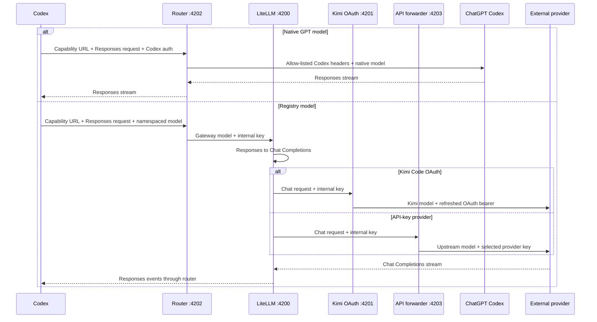

# How Codex Router works

The provider core has one app frontend: Codex uses the Responses API and a
merged native catalog.

## Why a router is needed

The Codex App expects the Responses API and a Codex-shaped model catalog.
Kimi and DeepSeek expose OpenAI-compatible Chat Completions APIs with different
authentication and request details. Codex Router bridges those contracts while
leaving native GPT traffic on the normal ChatGPT Codex backend.

Four pieces make the integration work:

- A generated catalog places external models beside native GPT models.
- A dispatcher chooses native or external routing by namespaced model ID.
- LiteLLM translates Responses requests, streams, and tool calls.
- Credential forwarders inject only the selected provider's authentication.

## Request flow

## One registry, multiple consumers

The split registry tree under `config/` supplies the model mapping used by the
catalog, router, gateway generator, API forwarder, and doctor.

`enabled-providers.json` is a separate local policy owned by the router plane.
It controls routed picker visibility and dispatcher access. `model-picker.json`
stores the durable per-model decision, including explicit show choices, and the
Codex, DeepSeek Harness, Gemini, and Cursor publishers all consume that same state for
external models. In a signed-in Codex install, the native GPT catalog and its
base-entry visibility remain Codex-owned, so a router "hide all" action cannot
erase the original native picker. A known namespaced model whose provider is hidden receives a local
`provider_not_enabled` error; it is never mistaken for a native model or
forwarded with Codex authentication. The policy is read on each external
request, so provider visibility can change without restarting the service
(Codex itself still needs a restart to reload the picker catalog).
Catalog generation also requires a stored credential or valid OAuth session for
each enabled external provider. Native GPT entries are included only when
`codex login status` confirms an OpenAI login, so signed-out login-free users see
only their authenticated external models.

Signed-out catalogs additionally alias external models onto native GPT slugs.
The ChatGPT desktop app's model menu filters `model/list` results against a
server-delivered allowlist of native slugs, so an external slug can never
appear there. Aliased entries reuse the allowlisted slugs while carrying the
external model's display name, description, and reasoning levels; each aliased
model also keeps a hidden entry under its canonical slug so routing, doctor
checks, and saved configs continue to resolve. `native-aliases.json` records
the slug mapping; the router consults it when dispatching `/responses`, and
`control model-set`/`auth-mode` write the alias slug into the Codex config so
pickers highlight the active model. Signed-in catalog builds clear the alias
map, which restores native GPT routing.

| Picker model | Public slug | Gateway model | Upstream model |
| --- | --- | --- | --- |
| K2.7 Coding Highspeed OAuth | `kimi-oauth/kimi-for-coding-highspeed` | `kimi-oauth-kimi-for-coding-highspeed` | `kimi-for-coding-highspeed` |
| K2.7 Coding OAuth | `kimi-oauth/kimi-for-coding` | `kimi-oauth-kimi-for-coding` | `kimi-for-coding` |
| Kimi K3 OAuth | `kimi-oauth/k3` | `kimi-oauth-k3` | `k3` |
| Kimi K3 API | `kimi-api/kimi-k3` | `kimi-api-k3` | `kimi-k3` |
| DeepSeek V4 Flash | `deepseek/deepseek-v4-flash` | `deepseek-v4-flash` | `deepseek-v4-flash` |
| DeepSeek V4 Pro | `deepseek/deepseek-v4-pro` | `deepseek-v4-pro` | `deepseek-v4-pro` |
| Grok 4.5 OAuth | `grok-oauth/grok-4.5` | `grok-oauth-grok-4-5` | `grok-4.5` |
| Grok 4.5 | `grok-api/grok-4.5` | `grok-api-grok-4-5` | `grok-4.5` |
| Claude Opus 4.8 | `anthropic-api/claude-opus-4.8` | `anthropic-api-claude-opus-4-8` | `claude-opus-4-8` |
| GLM-5.2 Ollama Cloud | `ollama-cloud/glm-5.2` | `ollama-cloud-glm-5-2` | `glm-5.2` |
| GLM-5.3 Ollama Cloud | `ollama-cloud/glm-5.3` | `ollama-cloud-glm-5-3` | `glm-5.3:cloud` |
| GLM-5.3-Flash Ollama Cloud | `ollama-cloud/glm-5.3-flash` | `ollama-cloud-glm-5-3-flash` | `glm-5.3-flash:cloud` |
| Kimi K2.7 Code Ollama Cloud | `ollama-cloud/kimi-k2.7-code` | `ollama-cloud-kimi-k2-7-code` | `kimi-k2.7-code` |
| MiniMax M3 Ollama Cloud | `ollama-cloud/minimax-m3` | `ollama-cloud-minimax-m3` | `minimax-m3` |
| DeepSeek V4 Pro Ollama Cloud | `ollama-cloud/deepseek-v4-pro` | `ollama-cloud-deepseek-v4-pro` | `deepseek-v4-pro` |
| Qwen3.7 Max Plan | `qwen-plan/qwen3.7-max` | `qwen-plan-qwen3-7-max` | `qwen3.7-max` |
| Qwen3.7 Plus Plan | `qwen-plan/qwen3.7-plus` | `qwen-plan-qwen3-7-plus` | `qwen3.7-plus` |
| GLM-5.3 Coding Plan | `zai-coding/glm-5.3` | `zai-coding-glm-5-3` | `glm-5.3` |
| GLM-5.2 Coding Plan | `zai-coding/glm-5.2` | `zai-coding-glm-5-2` | `glm-5.2` |
| GLM-5-Turbo Coding Plan | `zai-coding/glm-5-turbo` | `zai-coding-glm-5-turbo` | `glm-5-turbo` |
| GLM-5.3-Flash Z.ai API | `zai-api/glm-5.3-flash` | `zai-api-glm-5-3-flash` | `glm-5.3-flash` |
| GLM-5.3 Z.ai API | `zai-api/glm-5.3` | `zai-api-glm-5-3` | `glm-5.3` |
| GLM-5.2 Z.ai API | `zai-api/glm-5.2` | `zai-api-glm-5-2` | `glm-5.2` |
| GLM-4.7 Z.ai API | `zai-api/glm-4.7` | `zai-api-glm-4-7` | `glm-4.7` |
| GLM-5.3 opencode Go | `opencode-go/glm-5.3` | `opencode-go-glm-5-3` | `glm-5.3` |

The native catalog objects are preserved rather than reconstructed, which keeps
current instructions and capability metadata from the installed Codex build.
Registry models clone a current native schema and replace picker-specific
metadata. They also rewrite the cloned GPT identity line in
`base_instructions` / `model_messages.instructions_template` so external models
do not claim to be based on GPT-5.

The integration deliberately keeps the built-in `openai` provider and points
it at a loopback `openai_base_url`. This makes named models appear in the normal
picker instead of replacing the provider with a generic `Custom` entry.

For a selected custom provider, the tray's login-free switch keeps the provider
id unchanged and temporarily replaces its complete table with a router-owned,
auth-free table that points Responses requests at the local router. The
built-in `openai` id is the deliberate
exception: Codex 0.141 requires authentication for its implicit definition,
while current Desktop builds reject any explicit `[model_providers.openai]`
override as reserved. A root-OpenAI configuration therefore keeps the proven
`codex-router` provider switch instead of writing a config one supported build
cannot load. Model selection stays in the native Codex picker: login-free
catalogs alias external models onto native slugs, and `control model-set`
switches the active model from the command line.

The switch snapshots every replaced custom-provider section and the prior root
model in protected state, then restores them exactly after an ownership check.
For the OpenAI fallback it also snapshots and restores the root
`model_provider`. It never changes any ChatGPT credential. It keeps an already
selected external model or selects the first model from a connected, enabled
provider. External routes continue to replace incoming authentication with only
the chosen provider's credential.

Catalog refresh writes a protected operation journal before it temporarily
parks this login-free transport. If the process or host stops in that window,
rerunning `bin/refresh-catalog` resumes only when the journal still matches the
exact provider state, provider tree, and model route. Ordinary config changes,
install, and doctor repair refuse while that journal is pending and name the
refresh command as the recovery path. State plus an inactive configuration
without that journal remains ambiguous and fails closed; edits made during an
interrupted refresh are never overwritten.

The managed base URL contains a separate random caller capability. The router
validates it before reading a model request or contacting any upstream. Codex
cannot attach an arbitrary router-specific header to the built-in provider, so
the capability is carried in the URL path. Status, migration, and support tools
redact it, while Codex config and all snapshots are current-user-only files.
The router additionally requires JSON content, rejects browser-origin headers,
and never grants CORS access.

### Capability-gated embeddings

The caller-capability `/v1/embeddings` edge resolves a registered routed model
and refuses it unless that exact model declares `/embeddings` in
`supportedEndpoints`. It rewrites only the public slug to the gateway model,
then re-enters the credential-owning API forwarder; that forwarder rewrites the
gateway model to the upstream id and otherwise preserves the embeddings JSON.
The body never enters LiteLLM or a chat/Responses adapter. Unknown, hidden, and
undeclared models fail before an upstream request.

Both directions have an 8 MiB default bound. Client cancellation aborts the
internal and provider requests, caller query parameters are not relayed, and
the route performs no automatic retry because a provider may already have
billed the input before a transport failure. Endpoint-only models stay
unlisted so the Codex picker cannot advertise them as conversational models.
Both hops refuse redirects so a 307/308 cannot replay the POST, and
Messages-native providers cannot declare this OpenAI endpoint.

## Credential boundaries

| Route | Incoming Codex credential | Upstream credential |
| --- | --- | --- |
| Native GPT, image generation, and web search | Allow-listed and forwarded | Existing ChatGPT/Codex authentication |
| Kimi OAuth | Discarded | Kimi CLI OAuth bearer from `~/.kimi-code` |
| Kimi API | Discarded | Kimi Platform API key |
| DeepSeek | Discarded | DeepSeek API key |
| GitHub Copilot | Discarded | Stored fine-grained GitHub token, after Copilot entitlement and endpoint validation |
| Capability-gated embeddings | Router caller capability is consumed locally | The selected routed provider's isolated credential |

The Codex-to-router and internal-service trust boundaries use two different
random keys, each stored with mode `600` or a current-user Windows ACL. Neither
is a provider credential. Each external forwarder removes Codex account,
installation, attestation, and private headers before sending a request upstream.

GitHub Copilot adds one more credential boundary inside the shared API
forwarder. The stored fine-grained GitHub token is sent to GitHub's Copilot
account endpoint first, which validates entitlement and returns the account's
inference endpoint. That endpoint is accepted only when it resolves to a
GitHub-owned Copilot host, so account metadata cannot redirect the token to an
arbitrary server. The forwarder refreshes account routing once on a 401, before
relaying any response byte.

## Provider normalization

Kimi K3 API requests select `kimi-k3` and force maximum reasoning. Kimi Code
OAuth retains its own refresh and device-identity behavior.

DeepSeek V4 requests select the exact official upstream model, enable thinking,
and map Codex reasoning levels to DeepSeek's supported `high` and `max` values.
Sampling parameters that DeepSeek documents as ineffective in thinking mode are
removed. Both current V4 models use the same shared forwarder and credential.

The retired DeepSeek alias routes remain hidden registry entries. This keeps
old CLI commands working only as long as DeepSeek continues serving those
upstream aliases without advertising them to new users.

### Standalone web search

Codex 0.146 and newer can execute web search itself for a custom model
provider. A routed model may opt in with `"searchTool": { "mode":
"standalone" }`; the merged catalog then advertises the search capability and
Codex sends the search result back through the normal routed Responses turn.
This is a per-model compatibility declaration, not a claim that the upstream
provider hosts search. Only enable it after verifying that the provider's
model accepts Codex's web-search result items and preserves tool/function-call
history. The managed Codex provider block sets
`supports_standalone_web_search = true` because Codex requires that provider
half before any verified routed model can execute standalone search. It is not
the advertisement gate: the merged catalog exposes search only for an exact
model/provider route with a `searchTool` declaration (or a ready exact sidecar
binding). An OpenAI-compatible endpoint proves neither capability. If Codex
still sends ambient hosted-search extensions to an unsupported runtime-generic
route, the router strips those extensions at its managed Responses boundary;
it does not mutate direct gateway calls or ordinary caller-owned functions.

The checked-in registry currently enables this mode for DeepSeek V4 Flash on
its direct API and opencode Go routes, DeepSeek V4 Flash Vision Exp, Xiaomi
MiMo v2.5, and GLM-5.3 on the Z.ai Coding Plan. Other provider/model pairs
stay off until verified -- including GLM-5.3 on the opencode Go relay, which
is a different transport from the Z.ai route the capability was proven on. An
operator can opt in locally only by adding `searchTool` to that exact entry in
the protected `user-models.json` after verifying the route. The curation CLI
does not ask for or infer search mode from an upstream catalog claim.

Accepting a completed `web_search_call` in conversation history is a narrower
input-compatibility capability than executing a new search. A route that has
been live-tested for history replay may declare `supportsSearchHistory: true`
without a `searchTool`; this keeps new search unavailable while allowing that
route to continue or compact an existing searched conversation. The flag is
false by default and, like `searchTool`, belongs to the exact model/provider
route rather than to an OpenAI-compatible protocol family.

### Per-model search sidecar

A model without `searchTool` can be opted into the Perplexity Search sidecar.
The model catalog advertises search only while the exact binding, trusted
generic-provider descriptor, and protected credential are all ready. Codex's
authenticated `/alpha/search` request is then handled locally and never falls
through to the native ChatGPT search backend. Unbound requests retain the
native behavior above.

The sidecar does not accept an arbitrary destination. Its provider must be an
enabled, public-only generic `openai-chat` descriptor whose base URL is exactly
`https://api.perplexity.ai`, and the request path is fixed to `/search`. The
generic-provider transport resolves and pins the destination, refuses private
addresses and redirects, and attaches the credential inside that boundary.
Returned citations receive their own public-DNS and credential checks before
they become model-visible data.

The accepted wire subset is deliberately smaller than a general browser:
one through four `search_query` entries, each containing only `q`. Results,
body size, text length, retry count, timeout, backoff, and cache size/TTL are
bounded by the versioned per-model policy. One operation deadline covers the
adapter, response read, result DNS checks, retries, and backoff. Cancellation
propagates from the Codex request. Usage records contain status, duration,
attempt/cache/result counts, model, and provider id, never query text,
citations, endpoints, or credentials.

## Transport and compaction

Current Codex builds use the Responses WebSocket v2 transport. The router
authenticates the caller capability before upgrading, accepts
`response.create` messages, reconstructs full history when Codex sends a
`previous_response_id` delta, and re-enters its own caller-authenticated HTTP
Responses route. SSE response events are translated back to WebSocket JSON
frames. The WebSocket edge never selects or contacts a provider itself, and
the caller capability is never relayed to an upstream. HTTP request bodies may
use Zstandard, gzip, deflate, or Brotli; the router safely decompresses them
before inspecting the model ID.

Codex can compact history through `/responses/compact` or a
`compaction_trigger`. External Chat Completions providers cannot create OpenAI's
opaque encrypted compaction payload. The router therefore assigns stable source
IDs to the visible transcript, asks the selected external model for a structured
selection of those IDs, and validates the selection before creating a
router-owned `kcr2:` checkpoint. `U` entries preserve user requirements, `C`
entries record only that the model requested a tool call and do not prove that
execution started or completed, and `R` entries preserve the tool's returned
status and a bounded, redacted excerpt. Assistant-authored `A` entries and every
free-form model conclusion remain unverified navigation.

Excerpt redaction reuses the router's managed caller-URL sanitizer and removes
obvious named credentials and recognized token prefixes before either the
source catalog or checkpoint is serialized. This is a narrow secret-safety
control, not a general PII or arbitrary-string data-loss-prevention system.

`kcr2` is Base64-encoded JSON, not encryption or a tamper-evident signature. Its
trust boundary prevents model-authored summaries from becoming evidence; it does
not defend against a client that deliberately rewrites request history. It
carries at most 32 referenced sources, a 32 KiB recent tail, stable counters for
repeated compaction, and an explicit warning that historical evidence does not
prove mutable current state. The router preserves unresolved unknowns across
another compaction and never asks a second model to bless the first model's
prose. Invalid JSON or schema produces a safe checkpoint with no newly trusted
references. Source IDs and counters must remain positive safe integers, and the
source catalog sent to the model is capped at 96 KiB after JSON encoding. A model
may select only IDs present in that catalog; fabricated, misclassified, or
undisclosed IDs are rejected and recorded as an unverified warning. Providers
that wrap their answer in prose or a Markdown fence are tolerated only when the
response is at most 256 KiB and contains exactly one complete object that passes
the checkpoint contract; incomplete or ambiguous JSON still fails closed. The
router reads that contract only from the final Responses `message` (or the Chat
Completions message fallback); separate `reasoning` output is a draft and never
participates in KCR2 parsing. The latest two user messages are offered ahead of
early requirements and newer tool traffic, and they are reserved in the bounded
recent tail as well. The v1 compact replacement history replays at most those
latest two ordinary user messages, subject to its existing 80,000-character
complete-message budget, before the rendered checkpoint. Older user messages
survive only when selected into bounded KCR2 evidence; otherwise their state is
unknown rather than silently replayed as a current instruction. An over-budget
message is represented by the checkpoint's explicitly truncated head-and-tail
excerpt rather than by an unmarked tail fragment. KCR2 is intentionally lossy:
its goal is to prevent unsupported conclusions, not to reconstruct a complete
transcript.

Existing `kcr1:` payloads and the plain continuation messages emitted by the old
v1 compact endpoint remain readable for compatibility, but replay labels their
model-written text `UNVERIFIED_LEGACY_SUMMARY`. Native OpenAI compaction items
remain opaque and byte-preserved on native OpenAI requests; they are never
decoded or promoted to evidence.

Routed turns that carry a native OpenAI compaction item are unchanged by this
work: the router does not yet build a checkpoint from them, and continues to
follow its existing unreadable-compaction path. Bridging that boundary means
generating a checkpoint on an ordinary turn, which puts summarization work --
and its provider call -- on the request path, so it is deliberately held back
for its own change rather than landing behind the checkpoint format.

Standalone `/images/generations` and `/images/edits` requests always pass through
to the native OpenAI Codex backend with filtered Codex authentication headers.
They are never sent to an external model provider.

Commands, permissions, MCP tools, skills, and task state remain in Codex. Only
model inference and external-model compaction are routed.

Codex collaboration messages can place a delegated subagent task in native
OpenAI `encrypted_content`. External providers cannot read that opaque item. For
routed subagents only, the router uses the already-authenticated native Codex
backend to relay the exact task payload through a constrained function call,
replaces the opaque item with plaintext, and then sends the task to the selected
external model. Ordinary routed prompts do not use this relay.
The relay requires an active ChatGPT sign-in because only the native Codex
backend can open its own opaque payload. In login-free mode the router fails
closed instead of forwarding unreadable ciphertext to an external provider.

At service startup, the post-health reconciliation checks both native model
metadata and the router-managed Codex agent definitions. If the native catalog
is current but a routed `router-model-*.toml` definition is missing, stale,
unprotected, or left over for a model that is no longer eligible, the installed
picker is republished to restore the coupled catalog/agent state. An unreadable
or foreign Codex transport is never repaired speculatively.

Only registry-proven models are advertised as native v2 spawn-agent overrides.
The Settings tab (desktop panel and macOS tray) exposes two local accordions:
**Subagent models** can withhold or re-enable proven models, while **Model
picker** controls visibility. Local settings never promote an unverified model
to `multi_agent_version: "v2"`; that capability requires the checked-in native
collaboration proof. A model hidden from the picker is not exposed as a
subagent. Each accordion also has select-all and unselect-all bulk actions.

On Codex 0.147, a child's FINAL_ANSWER is recorded as `subAgentActivity`
`interacted` and stays visually working for the whole live parent turn.
`close_agent` is not in that v2 toolset. The managed `multi_agent_v2` block
therefore also sets `usage_hint_enabled` and tells the root agent to call
`interrupt_agent` on a finished child. Because long multi-agent parents
still skip that call, the router additionally injects any missing
`interrupt_agent` tool calls into the parent response when the request input
already contains those children's FINAL_ANSWER messages. That is the only
path that settles the badge without the user clicking into each child.
